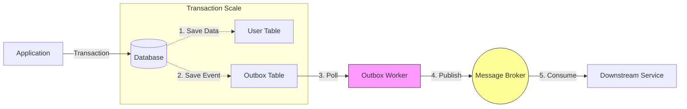

# outbox-event-bus


> **Never Lose an Event Again**
>
> Storage-agnostic outbox event bus. Persist events transactionally alongside your data. Guaranteed at-least-once delivery with robust retries.


## Quick Start

```bash
npm install outbox-event-bus @outbox-event-bus/postgres-prisma-outbox @prisma/client
```

```typescript
import { OutboxEventBus } from '@outbox-event-bus/core'
import { PostgresPrismaOutbox } from '@outbox-event-bus/postgres-prisma-outbox'

// NOTE: This library enforces a strict 1:1 Command Bus pattern. 
// One Event Type = One Handler.
// This ensures safe, isolated retries without side-effects.

// BEFORE: Dangerous, flaky, unsafe
async function unsafeCreateUser(newUser) {
  // 1. Write to DB
  const user = await db.users.create(newUser)
  
  // 2. Emit Event - WHAT IF THIS FAILS?
  // If the process crashes here, your system is inconsistent.
  // The user exists, but no welcome email is sent.
  await eventBus.emit('user.created', user) 
  
  return user
}

// AFTER: Atomic, reliable, safe
async function safeCreateUser(newUser) {
  // 1. Start a transaction
  await db.$transaction(async (transaction) => {
    // A. Write to DB
    const user = await transaction.users.create(newUser)

    // B. Emit to Outbox
    // Pass the transaction explicitly to ensure atomic commit.
    // Both the user creation and event are committed together.
    await bus.emit({
      type: 'user.created',
      payload: user
    }, transaction)
  })
  
  // 2. The background worker picks up the event and delivers it.
  // If it fails, it retries with exponential backoff.
}
```

## The Problem

In distributed systems, **dual writes are the root of all evil**.

1.  **You write to your database.** (Success)
2.  **You try to publish an event.** (Failure?)

If step 2 fails (network blip, broker down, process crash), your system is now **inconsistent**. Your local database says one thing, but the rest of your system knows nothing about it.

## The Solution

**The Transactional Outbox Pattern (and beyond)**.

Instead of sending the event directly to the broker, you save the event to your own data store first. This ensures that the intent to send an event is captured durably before the network request is ever made.



1.  **Durable Capture**: The event is saved to your storage (Postgres, Mongo, Redis, etc.) alongside your data.
2.  **Guaranteed at-least-once Delivery**: A separate background worker (the Poller) reads the saved events and publishes them only after they are safely stored.
3.  **Resilient Retries**: If the publisher fails, the poller retries with exponential backoff.
4.  **Optional Atomicity**: When using a transactional database (like Postgres), you can use transactions to ensure your data and events are committed together with absolute consistency.

---

## 📖 Key Concepts

### Type System

The library uses a clear type distinction between events you create and events that are stored:

```typescript
// BusEventInput: What you provide when emitting events
type BusEventInput<T extends string = string, P = unknown> = {
  type: T
  payload: P
  id?: string              // Optional - auto-generated if not provided
  occurredAt?: Date        // Optional - defaults to new Date()
  metadata?: Record<string, unknown>
}

// BusEvent: What gets stored and passed to handlers
type BusEvent<T extends string = string, P = unknown> = {
  id: string               // Always present
  type: T
  payload: P
  occurredAt: Date         // Always present
  metadata?: Record<string, unknown>
}
```

**Why this matters:**
- You don't need to generate IDs or timestamps manually
- Handlers always receive fully-populated events
- Type safety ensures you can't forget required fields

### Storage-Agnostic Architecture
Unlike traditional outbox libraries tied to a specific ORM or database, `outbox-event-bus` works with **any storage backend**.
- **SQL Databases**: Use ACID transactions for perfect atomicity
- **NoSQL Stores**: Leverage durable persistence without multi-document transaction requirements
- **Key-Value Stores**: High-speed persistence for lightweight event flows
- **Mix and Match**: Combine any storage adapter with any publisher—complete flexibility

### Generic Transaction Support

The event bus is generic over transaction types, providing full type safety for your specific database:

```typescript
import { OutboxEventBus } from 'outbox-event-bus'
import { PrismaClient } from '@prisma/client'
import type { Prisma } from '@prisma/client'

// Type the bus with your transaction type
const bus = new OutboxEventBus<Prisma.TransactionClient>(outbox, errorHandler)

// Now TypeScript knows what transaction type to expect
await db.$transaction(async (transaction) => {
  const user = await transaction.users.create({ data: newUser })
  
  // Transaction parameter is fully typed
  await bus.emit({ 
    type: 'user.created', 
    payload: user 
  }, transaction)
})
```

**Supported Transaction Types:**
- **Prisma**: `Prisma.TransactionClient`
- **Drizzle**: Database transaction object
- **MongoDB**: `ClientSession`
- **DynamoDB**: `TransactWriteItem[]` (transaction collector)
- **Redis**: `Pipeline` object
- **SQLite**: Database transaction object

### Strict 1:1 Command Bus Architecture
This library enforces a **Command Bus pattern**: Each event type can have exactly **one** handler.
- **Why?** If you have 2 handlers and one fails, retrying the event would re-run the successful handler too (double side-effects).
- **Solution:** Strict 1:1 binding ensures that if a handler fails, only that specific logic is retried.
- **Fan-Out:** If you need multiple actions (e.g., Send Email + Index Search), use the "Fan-Out Pattern": The main handler should publish new "Intent Events" (`send-email`, `index-search`) back to the outbox.

### Guaranteed Delivery with Resilient Retries
- **At-Least-Once Delivery**: Events are retried until successful delivery or max retries exceeded
- **Exponential Backoff**: Automatic retry delays that double with each attempt (1s → 2s → 4s → 8s...)
- **Durable Failure Tracking**: Failed events persist in your database with error details for inspection and manual retry
- **Idempotency Required**: Consumers should handle duplicate events gracefully

---

## 🛡️ Reliability & Failure Handling

What happens when an event fails?

By default, `outbox-event-bus` will retry failed events **5 times** with exponential backoff.

- **Durable Failure Tracking**: Failed events are marked as `failed` in your database and **never deleted**
- **Error Inspection**: Each failed event stores the `last_error` message for debugging
- **Manual Recovery**: Reset the status to `created` to trigger a re-delivery after fixing the underlying issue
- **Zero Data Loss**: Events persist in your primary database, surviving application restarts and broker outages
- **Audit Trail**: Complete event history remains queryable for compliance and debugging
- **Efficient Batching**: Publishers **batch events by default** to maximize throughput:
  - **Core Default**: 100 items or 100ms timeout
  - **AWS Publishers** (SQS, SNS, EventBridge): 10 items or 100ms timeout (respects AWS API limits)
  - **Automatic Chunking**: AWS publishers automatically split larger batches into multiple API calls

## 🧩 Adapters & Ecosystem

Mix and match any storage adapter with any publisher.

### 💾 Storage Adapters (The "Outbox")

These store your events. Choose one that matches your primary database.

| Adapter | Best For | Status | Package |
|:---|:---|:---:|:---|
| **[Postgres (Prisma)](./adapters/postgres-prisma/README.md)** | Prisma Users | ✅ | `@outbox-event-bus/postgres-prisma-outbox` |
| **[Postgres (Drizzle)](./adapters/postgres-drizzle/README.md)** | SQL Purists | ✅ | `@outbox-event-bus/postgres-drizzle-outbox` |
| **[MongoDB](./adapters/mongo/README.md)** | Document Stores | ✅ | `@outbox-event-bus/mongo-outbox` |
| **[DynamoDB](./adapters/dynamodb/README.md)** | Serverless | ✅ | `@outbox-event-bus/dynamodb-outbox` |
| **[Redis](./adapters/redis/README.md)** | High Speed | ⚠️ | `@outbox-event-bus/redis-outbox` |
| **[SQLite](./adapters/sqlite/README.md)** | Local/Edge | ✅ | `@outbox-event-bus/sqlite-outbox` |

### 📢 Publishers (The "Transport")

These send your events to the world.

| Publisher | Target | Package |
|:---|:---|:---|
| **[AWS SQS](./publishers/sqs/README.md)** | Amazon SQS Queues | `@outbox-event-bus/sqs-publisher` |
| **[AWS SNS](./publishers/sns/README.md)** | Amazon SNS Topics | `@outbox-event-bus/sns-publisher` |
| **[EventBridge](./publishers/eventbridge/README.md)** | AWS Event Bus | `@outbox-event-bus/eventbridge-publisher` |
| **[RabbitMQ](./publishers/rabbitmq/README.md)** | AMQP Brokers | `@outbox-event-bus/rabbitmq-publisher` |
| **[Kafka](./publishers/kafka/README.md)** | Streaming | `@outbox-event-bus/kafka-publisher` |
| **[Redis Streams](./publishers/redis-streams/README.md)** | Lightweight Stream | `@outbox-event-bus/redis-streams-publisher` |


## 📚 API Reference

### OutboxEventBus

The main event bus orchestrator. Provides an event emitter interface with durable persistence.

#### Constructor

```typescript
class OutboxEventBus<TTransaction> {
  constructor(
    outbox: IOutbox<TTransaction>,
    onError: (error: unknown) => void
  )
}
```

**Parameters:**
- `outbox`: Storage adapter implementing the `IOutbox` interface
- `onError`: Global error handler for unhandled errors during event processing

#### Methods

##### emit()
Emit a single event to the outbox.

```typescript
await bus.emit<T extends string, P>({
  type: T,
  payload: P,
  id?: string,
  occurredAt?: Date,
  metadata?: Record<string, unknown>
}, transaction?: TTransaction): Promise<void>
```

##### emitMany()
Emit multiple events atomically.

```typescript
await bus.emitMany([
  { type: 'user.created', payload: user },
  { type: 'email.queued', payload: { to: user.email } }
], transaction?): Promise<void>
```

##### on() / addListener()
Register a handler for an event type. **One handler per event type** (Command Bus pattern).

```typescript
bus.on('user.created', async (event: BusEvent<'user.created', User>) => {
  await sendWelcomeEmail(event.payload)
})
```

##### once()
Register a one-time handler that auto-removes after first execution.

```typescript
bus.once('migration.complete', async (event) => {
  console.log('Migration finished!')
})
```

##### off() / removeListener()
Remove a specific handler.

```typescript
bus.off('user.created', myHandler)
```

##### removeAllListeners()
Remove all handlers, or all handlers for a specific event type.

```typescript
bus.removeAllListeners()              // Remove all
bus.removeAllListeners('user.created') // Remove for specific type
```

##### subscribe()
Register a handler for multiple event types.

```typescript
bus.subscribe(['order.created', 'order.updated'], async (event) => {
  await syncToWarehouse(event)
})
```

##### waitFor()
Wait for a specific event to be emitted (useful in tests).

```typescript
const event = await bus.waitFor('user.created', 5000) // 5s timeout
```

##### start()
Start the background polling worker.

```typescript
bus.start()
```

##### stop()
Stop the background worker and clean up resources.

```typescript
await bus.stop()
```

---

### EventPublisher

Manages reliable delivery from the outbox to message brokers with batching and retries.

#### Constructor

```typescript
class EventPublisher<TTransaction> {
  constructor(
    bus: IOutboxEventBus<TTransaction>,
    config?: PublisherConfig
  )
}
```

#### Configuration

```typescript
interface PublisherConfig {
  retryConfig?: {
    maxAttempts?: number      // Default: 3
    initialDelayMs?: number   // Default: 1000
    maxDelayMs?: number       // Default: 10000
  }
  batchConfig?: {
    batchSize?: number        // Default: 100 (core), 10 (AWS publishers)
    batchTimeoutMs?: number   // Default: 100
  }
}
```

**Retry Behavior:**
- Exponential backoff: delays double with each attempt (1s → 2s → 4s...)
- Capped at `maxDelayMs`
- After `maxAttempts`, the error bubbles to the outbox error handler

**Batching Behavior:**
- Events are buffered until `batchSize` is reached OR `batchTimeoutMs` elapses
- AWS publishers automatically chunk batches larger than 10 into multiple API calls
- Set `batchSize: 1` to disable batching

#### Methods

##### subscribe()
Subscribe to event types and forward them to a handler.

```typescript
publisher.subscribe(
  ['user.created', 'user.updated'],
  async (events: BusEvent[]) => {
    // Publish batch to external system
    await sqsClient.send(new SendMessageBatchCommand({ ... }))
  }
)
```

---

### IOutbox Interface

Adapter interface for implementing custom storage backends.

```typescript
interface IOutbox<TTransaction> {
  publish(events: BusEvent[], transaction?: TTransaction): Promise<void>
  start(handler: (event: BusEvent) => Promise<void>, onError: (error: unknown) => void): void
  stop(): Promise<void>
}
```

**Implementing a Custom Adapter:**
1. Implement `publish()` to store events in your database
2. Implement `start()` to poll for pending events and call the handler
3. Implement `stop()` to clean up polling resources
4. Handle retry logic, status tracking, and stuck event recovery

See existing adapters for reference implementations.

---

## Quick Start Example

```typescript
import { OutboxEventBus, InMemoryOutbox } from 'outbox-event-bus';

// 1. Initialize Storage
// (Use a real adapter in production, e.g., PostgresPrismaOutbox)
const outbox = new InMemoryOutbox();

// 2. Create Bus
const bus = new OutboxEventBus(outbox, (error) => console.error(error));

// 3. Start the Poller
bus.start();

// 4. Emit Events (Reliably)
await bus.emit({
  type: 'user.created',
  payload: { id: 1, name: 'Alice' }
});
```

## Fan-Out Pattern Example

To perform multiple actions for a single event, use the **Fan-Out Pattern**:

```typescript
// 1. Initial Event
bus.on('user.created', async (event) => {
  // Fan-out: Publish intent events back to the outbox
  await bus.emitMany([
    { type: 'send-welcome-email', payload: event.payload },
    { type: 'sync-to-salesforce', payload: event.payload }
  ])
})

// 2. Specialized Handlers (1:1)
bus.on('send-welcome-email', async (event) => {
  await emailService.send(event.payload.email)
})

bus.on('sync-to-salesforce', async (event) => {
  await crm.sync(event.payload)
})
```

## Contributing

We welcome PRs! 

1. **Fork** the repository.
2. **Clone** it locally.
3. Install dependencies: `npm install`.
4. Run tests: `npm test`.

See [CONTRIBUTING.md](./CONTRIBUTING.md) for detailed setup.

## License

MIT © [Dunika](https://github.com/dunika)
