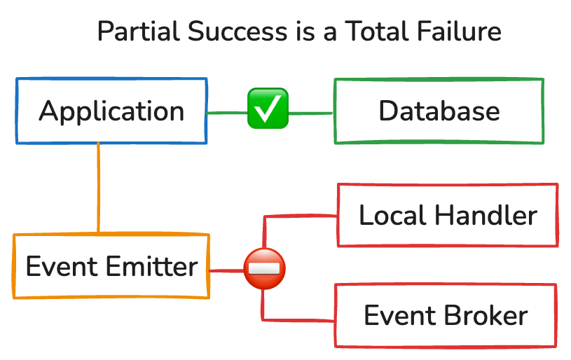
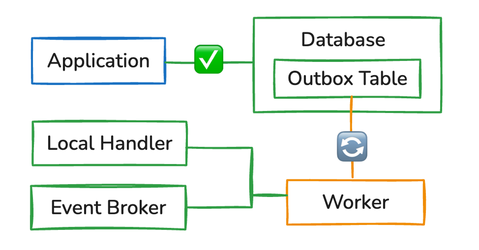
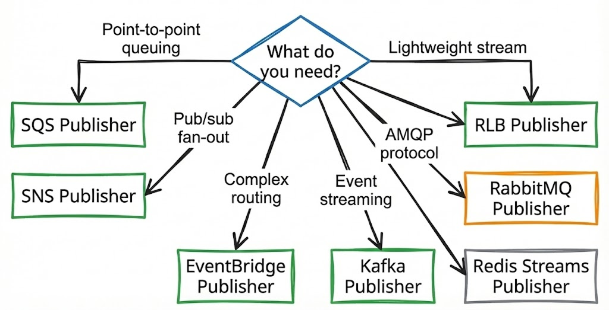

# outbox-event-bus

<div align="center">


</div>

> **Never Lose an Event Again**
>
> Transactional outbox pattern made simple. Persist events atomically with your data. Guaranteed delivery with your database.

**The Problem**: You save data to your database and attempt to emit a relevant event. If your process crashes or the network fails before the event is sent, your system becomes inconsistent.



**The Solution**: `outbox-event-bus` stores events in your database *within the same transaction* as your data. A background worker then reliably delivers them.



## Quick Start (Postgres + Drizzle ORM + SQS Example)

```bash
npm install outbox-event-bus @outbox-event-bus/postgres-drizzle-outbox drizzle-orm @outbox-event-bus/sqs-publisher
```

```typescript
import { OutboxEventBus } from 'outbox-event-bus';
import { PostgresDrizzleOutbox } from '@outbox-event-bus/postgres-drizzle-outbox';
import { SQSPublisher } from '@outbox-event-bus/sqs-publisher';

// 1. Setup
const outbox = new PostgresDrizzleOutbox({ db });
const bus = new OutboxEventBus(outbox, (err) => console.error(err));

// Forward messages to- 
const publisher = new SQSPublisher(bus, { queueUrl: '...', sqsClient: '... });
publisher.subscribe(['sync-to-sqs']);

// 2. Register Handlers
bus.on('user.created', async (event) => {
  // Fan Out as needed
  await bus.emitMany([
    { type: 'send.welcome', payload: event.payload },
    { type: 'sync-to-sqs', payload: event.payload }
  ]);
});

bus.on('send.welcome', async (event) => {
  await emailService.sendWelcome(event.payload.email);
});


// 3. Start the Bus
bus.start();

// 4. Emit Transactionally
await db.transaction(async (transaction) => {
  const [user] = await transaction.insert(users).values(newUser).returning();
  
  // Both operations commit together or rollback together
  await bus.emit({ type: 'user.created', payload: user }, transaction);
});
```

## Why outbox-event-bus?

- **Zero Event Loss**: Events persist atomically with your data using database transactions.
- **Storage Agnostic**: Works with any database. **Use our built-in adapters** for Postgres, MongoDB, DynamoDB, Redis, and SQLite, or create your own.
- **Guaranteed Delivery**: At-least-once semantics with exponential backoff and dead letter handling.
- **Safe Retries**: Strict 1:1 command bus pattern prevents duplicate side-effects.
- **Built-in Publishers**: Comes with optional publishers for SQS, SNS, Kafka, RabbitMQ, Redis Streams, and EventBridge
- **TypeScript First**: Full type safety with generics for events, payloads, and transactions.

## Contents

- [Concepts](#concepts)
- [How-To Guides](#how-to-guides)
- [API Reference](./docs/API_REFERENCE.md)
- [Adapters & Publishers](#adapters--publishers)
- [Production Guide](#production-guide)
- [Contributing](./docs/CONTRIBUTING.md)
- [License](#license)


## Concepts

### Strict 1:1 Command Bus Pattern

> [!IMPORTANT]
> This library enforces a **Command Bus pattern**: Each event type can have exactly **one** handler.

**Why?**
- If you have 2 handlers and one fails, retrying the event would re-run the successful handler too (double side-effects)
- Example: `user.created` triggers "Send Welcome Email", "Send Analytics" and "Sync to SQS". If "Send Analytics" fails and retries, "Send Welcome Email" runs again → duplicate emails

**Solution:** Strict 1:1 binding ensures that if a handler fails, only that specific logic is retried.

**Fan-Out Pattern:** If you need multiple actions, publish new "intent events" from your handler:

```typescript
// Main handler
bus.on('user.created', async (event) => {
  // Fan-out: Publish intent events back to the outbox
  await bus.emitMany([
    { type: 'send.welcome', payload: event.payload },
    { type: 'send.analytics', payload: event.payload },
    { type: 'sync-to-sqs', payload: event.payload }
  ]);
});

// Specialized handlers (1:1)
bus.on('send.welcome', async (event) => {
  await emailService.sendWelcome(event.payload.email);
});

bus.on('send.analytics', async (event) => {
  await analyticsService.track(event.payload);
});
```

### Event Lifecycle

Events flow through several states from creation to completion:


**State Descriptions:**

| State | Description | Next States |
|:---|:---|:---|
| `created` | Event saved to outbox, waiting to be processed | `active` (claimed by worker) |
| `active` | Event claimed by worker, handler executing | `completed` (success), `failed` (error), `active` (timeout) |
| `completed` | Handler succeeded, event ready for archival | `archived` (maintenance) |
| `failed` | Error occurred (retry pending or max retries exceeded) | `active` (retry), Manual intervention (max retries) |

**Stuck Event Recovery:**

If a worker crashes while processing an event (status: `active`), the event becomes "stuck". The outbox adapter automatically reclaims stuck events after `processingTimeoutMs` (default: 30s).

**SQL Example (Postgres/SQLite):**
```sql
-- Events stuck for more than 30 seconds are reclaimed
SELECT * FROM outbox_events 
WHERE status = 'active' 
  AND keep_alive < NOW() - INTERVAL '30 seconds';
```

> **Note:** Non-SQL adapters (DynamoDB, Redis, Mongo) implement equivalent recovery mechanisms using their native features (TTL, Sorted Sets, etc).

## How-To Guides

### Working with Transactions (Prisma + Postgres Example)

```typescript
import { PrismaClient } from '@prisma/client';
import { PostgresPrismaOutbox } from '@outbox-event-bus/postgres-prisma-outbox';
import { OutboxEventBus } from 'outbox-event-bus';

const prisma = new PrismaClient();
const outbox = new PostgresPrismaOutbox({ prisma });
const bus = new OutboxEventBus(outbox);

bus.start();

// Register handler
bus.on('user.created', async (event) => {
  await emailService.sendWelcome(event.payload.email);
});

// Emit within a transaction
async function createUser(userData: any) {
  await prisma.$transaction(async (transaction) => {
    // 1. Create user
    const user = await transaction.user.create({ data: userData });
    
    // 2. Emit event (will commit with the user creation)
    await bus.emit({ type: 'user.created', payload: user }, transaction);
  });
}
```

### Async Transactions (SQLite + better-sqlite3 Example)

SQLite transactions are synchronous by default. To use `await` with the event bus, use the `withBetterSqlite3Transaction` helper which manages the transaction scope for you.

```typescript
import Database from 'better-sqlite3';
import { SqliteBetterSqlite3Outbox, withBetterSqlite3Transaction, getBetterSqlite3Transaction } from '@outbox-event-bus/sqlite-better-sqlite3-outbox';
import { OutboxEventBus } from 'outbox-event-bus';

const db = new Database('app.db');
const outbox = new SqliteBetterSqlite3Outbox({ 
  dbPath: 'app.db',
  getTransaction: getBetterSqlite3Transaction() 
});
const bus = new OutboxEventBus(outbox);

bus.start();

async function createUser(userData: any) {
  return withBetterSqlite3Transaction(db, async (transaction) => {
    const stmt = transaction.prepare('INSERT INTO users (name) VALUES (?)');
    const info = stmt.run(userData.name);
    
    await bus.emit({ 
      type: 'user.created', 
      payload: { id: info.lastInsertRowid, ...userData } 
    });
    
    return info;
  });
}
```

> **Note:** Similar helpers (`withPrismaTransaction`, `withDrizzleTransaction`, `withMongodbTransaction`, etc.) are available in other adapters to simplify transaction management and avoid passing transaction objects manually.

### Environment-Specific Adapters

```typescript
import { InMemoryOutbox } from 'outbox-event-bus';
import { PostgresPrismaOutbox } from '@outbox-event-bus/postgres-prisma-outbox';

const outbox = process.env.NODE_ENV === 'production'
  ? new PostgresPrismaOutbox({ prisma })
  : new InMemoryOutbox();

const bus = new OutboxEventBus(outbox);
```

### Testing Event Handlers

**Problem:** How do I test event-driven code without a real database?

**Solution:** Use `InMemoryOutbox` and `waitFor`:

```typescript
import { describe, it, expect } from 'vitest';
import { OutboxEventBus, InMemoryOutbox } from 'outbox-event-bus';

describe('User Creation', () => {
  it('sends welcome email when user is created', async () => {
    const outbox = new InMemoryOutbox();
    const bus = new OutboxEventBus(outbox);
    
    let emailSent = false;
    bus.on('user.created', async (event) => {
      emailSent = true;
    });
    
    bus.start();
    
    await bus.emit({ type: 'user.created', payload: { email: 'test@example.com' } });
    await bus.waitFor('user.created');
    
    expect(emailSent).toBe(true);
    
    await bus.stop();
  });
});
```

### Error Handling

The library provides typed errors to help you handle specific failure scenarios programmatically. All errors extend the base `OutboxError` class.

- **Configuration Errors**: `DuplicateListenerError`, `UnsupportedOperationError`
- **Validation Errors**: `BatchSizeLimitError`
- **Operational Errors**: `TimeoutError`, `BackpressureError`, `MaxRetriesExceededError`

#### Example

```typescript
import { OutboxEventBus, TimeoutError } from 'outbox-event-bus';

const bus = new OutboxEventBus(outbox, (err, event) => {
  if (err instanceof MaxRetriesExceededError) {
    console.warn(`Event ${event?.id} timed out, will retry...`);
  } else {
    console.error('Unexpected error:', err);
  }
});
```

For a complete list and usage examples, see the [API Reference](./docs/API_REFERENCE.md).

### Monitoring & Debugging

**Problem:** How do I monitor event processing errors in production?

**Solution:** Use the `onError` callback for infrastructure errors and query the outbox table for failed events (DLQ).

> **Note:** The `onError` callback captures unexpected errors (e.g., database connection loss, handler crashes). Events that simply fail processing and are retried are not considered "errors" until they exceed max retries, at which point they are marked as `failed` in the database.

```typescript
const bus = new OutboxEventBus(outbox, (error, event) => {
  // Log to your monitoring service
  logger.error('Event processing failed', {
    eventId: event?.id,
    eventType: event?.type,
    error: error.message,
    stack: error.stack
  });
  
  // Send to error tracking (Sentry, Datadog, etc.)
  Sentry.captureException(error, {
    tags: { eventType: event?.type },
    extra: { event }
  });
});
```

**Query failed events:**
```typescript
// Get failed events (if supported by adapter)
const failedEvents = await bus.getFailedEvents();
```

Or via SQL:
```sql
SELECT * FROM outbox_events 
WHERE status = 'failed' 
ORDER BY created_on DESC 
LIMIT 10;
```

### Handling Failures

**Problem:** An event failed after max retries. How do I retry it?

**Solution:** Use `retryEvents` or reset via SQL.

**Using API:**
```typescript
const failedEvents = await bus.getFailedEvents();
const idsToRetry = failedEvents.map(e => e.id);
await bus.retryEvents(idsToRetry);
```

**Using SQL:**
```sql
-- Reset a specific event
UPDATE outbox_events 
SET status = 'created', retry_count = 0, last_error = NULL 
WHERE id = 'event-id-here';

-- Reset all failed events of a type
UPDATE outbox_events 
SET status = 'created', retry_count = 0, last_error = NULL 
WHERE status = 'failed' AND type = 'user.created';
```

### Schema Evolution

**Problem:** I need to change my event payload structure. How do I handle old events?

**Solution:** Use versioned event types and handlers:

```typescript
// Old handler (still processes legacy events)
bus.on('user.created.v1', async (event) => {
  const { firstName, lastName } = event.payload;
  await emailService.send({ name: `${firstName} ${lastName}` });
});

// New handler (processes new events)
bus.on('user.created.v2', async (event) => {
  const { fullName } = event.payload;
  await emailService.send({ name: fullName });
});

// Emit new version
await bus.emit({ type: 'user.created.v2', payload: { fullName: 'John Doe' } });
```

## Adapters & Publishers

Mix and match any storage adapter with any publisher.

### Storage Adapters (The "Outbox")

These store your events. Choose one that matches your primary database.

| Database | Adapters | Transaction Support | Concurrency |
|:---|:---|:---:|:---|
| **Postgres** | [Prisma](./adapters/postgres-prisma/README.md), [Drizzle](./adapters/postgres-drizzle/README.md) | Full (ACID) | `SKIP LOCKED` |
| **MongoDB** | [Native Driver](./adapters/mongo-mongodb/README.md) | Full (Replica Set) | Optimistic Locking |
| **DynamoDB** | [AWS SDK](./adapters/dynamodb-aws-sdk/README.md) | Full (TransactWrite) | Optimistic Locking |
| **Redis** | [ioredis](./adapters/redis-ioredis/README.md) | Atomic (Multi/Exec) | Distributed Lock |
| **SQLite** | [better-sqlite3](./adapters/sqlite-better-sqlite3/README.md) | Full (ACID) | Serialized |

**Legend:**

- **Full**: ACID transactions with atomicity guarantees
- **Limited**: Single-document transactions or optimistic locking
- **None**: No transaction support (events saved separately)
- **SKIP LOCKED**: High-performance non-blocking reads for multiple workers

### Publishers

These send your events to the world.

| Publisher | Target | Batching | Package |
|:---|:---|:---:|:---|
| **[AWS SQS](./publishers/sqs/README.md)** | Amazon SQS Queues | Yes (10) | `@outbox-event-bus/sqs-publisher` |
| **[AWS SNS](./publishers/sns/README.md)** | Amazon SNS Topics | Yes (10) | `@outbox-event-bus/sns-publisher` |
| **[EventBridge](./publishers/eventbridge/README.md)** | AWS Event Bus | Yes (10) | `@outbox-event-bus/eventbridge-publisher` |
| **[RabbitMQ](./publishers/rabbitmq/README.md)** | AMQP Brokers | Yes (100) | `@outbox-event-bus/rabbitmq-publisher` |
| **[Kafka](./publishers/kafka/README.md)** | Streaming | Yes (100) | `@outbox-event-bus/kafka-publisher` |
| **[Redis Streams](./publishers/redis-streams/README.md)** | Lightweight Stream | Yes (100) | `@outbox-event-bus/redis-streams-publisher` |


### Choosing the Right Publisher



## Production Guide

> [!TIP]
> Start with conservative settings and tune based on your metrics. It's easier to increase throughput than to debug overload issues.

### Deployment Checklist

- [ ] **Database Schema**: Ensure outbox tables are created and migrated
- [ ] **Connection Pooling**: Size your connection pool for concurrent workers
- [ ] **Error Monitoring**: Set up error tracking (Sentry, Datadog, etc.)
- [ ] **Metrics**: Track event processing rates, retry counts, failure rates
- [ ] **Archiving**: Configure automatic archiving of completed events
- [ ] **Scaling**: Plan for horizontal scaling (multiple workers)

### Monitoring

**Key Metrics to Track:**

1. **Event Processing Rate**: Events/second processed
2. **Retry Rate**: Percentage of events requiring retries
3. **Failure Rate**: Percentage of events failing after max retries
4. **Processing Latency**: Time from event creation to successful delivery
5. **Queue Depth**: Number of pending events in the outbox


### Scaling

**Horizontal Scaling:**

Run multiple instances of your application. Each instance runs its own poller. The outbox adapter handles coordination using:

- **Row-level locking** (Postgres, SQLite): `FOR UPDATE SKIP LOCKED`
- **Optimistic locking** (MongoDB, DynamoDB): Version fields
- **Distributed locks** (Redis): Redlock algorithm

**Vertical Scaling:**

Increase `batchSize` and reduce `pollIntervalMs` for higher throughput:

```typescript
const outbox = new PostgresPrismaOutbox({
  prisma,
  batchSize: 100,        // Process 100 events per poll
  pollIntervalMs: 500    // Poll every 500ms
});
```

### Security

**Best Practices:**

1. **Encrypt Sensitive Payloads**: Use application-level encryption for PII
2. **IAM Permissions**: Grant minimal permissions to publishers (e.g., `sqs:SendMessage` only)
3. **Network Security**: Use VPC endpoints for AWS services
4. **Audit Logging**: Log all event emissions and processing

**Example: Encrypting Payloads**

Essential when forwarding events to external systems (SQS, Kafka) or to protect PII stored in the `outbox_events` table.

```typescript
import { encrypt, decrypt } from './crypto';

await bus.emit({
  type: 'user.created',
  payload: encrypt(user) // Encrypt before saving
});

bus.on('user.created', async (event) => {
  const user = decrypt(event.payload); // Decrypt in handler
  await emailService.send(user.email);
});
```

## License

MIT © [Dunika](https://github.com/dunika)

<div align="center">

**[⬆ Back to Top](#outbox-event-bus)**

</div>
