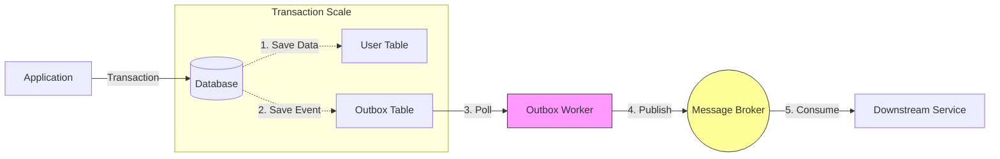

# outbox-event-bus


> **Never Lose an Event Again**
>
> Storage-agnostic outbox event bus. Persist events transactionally alongside your data. Guaranteed at-least-once delivery with robust retries.


## Quick Start

```bash
npm install outbox-event-bus @outbox-event-bus/postgres-prisma-outbox @prisma/client
```

```typescript
import { OutboxEventBus } from 'outbox-event-bus'
import { PostgresPrismaOutbox } from '@outbox-event-bus/postgres-prisma-outbox'

// BEFORE: Dangerous, flaky, unsafe
async function unsafeCreateUser(newUser) {
  // 1. Write to DB
  const user = await db.users.create(newUser)
  
  // 2. Emit Event - WHAT IF THIS FAILS?
  // If the process crashes here, your system is inconsistent.
  // The user exists, but no welcome email is sent.
  await eventBus.emit('user.created', user) 
  
  return user
}

// AFTER: Atomic, reliable, safe
async function safeCreateUser(newUser) {
  // 1. Start a transaction
  await db.$transaction(async (transaction) => {
    // A. Write to DB
    const user = await transaction.users.create(newUser)

    // B. Emit to Outbox
    // Pass the transaction explicitly to ensure atomic commit.
    // Both the user creation and event are committed together.
    await bus.emit({
      type: 'user.created',
      payload: user
    }, transaction)
  })
  
  // 2. The background worker picks up the event and delivers it.
  // If it fails, it retries with exponential backoff.
}
```

## The Problem

In distributed systems, **dual writes are the root of all evil**.

1.  **You write to your database.** (Success)
2.  **You try to publish an event.** (Failure?)

If step 2 fails (network blip, broker down, process crash), your system is now **inconsistent**. Your local database says one thing, but the rest of your system knows nothing about it.

## The Solution

**The Transactional Outbox Pattern (and beyond)**.

Instead of sending the event directly to the broker, you save the event to your own data store first. This ensures that the intent to send an event is captured durably before the network request is ever made.



1.  **Durable Capture**: The event is saved to your storage (Postgres, Mongo, Redis, etc.) alongside your data.
2.  **Guaranteed at-least-once Delivery**: A separate background worker (the Poller) reads the saved events and publishes them only after they are safely stored.
3.  **Resilient Retries**: If the publisher fails, the poller retries with exponential backoff.
4.  **Optional Atomicity**: When using a transactional database (like Postgres), you can use transactions to ensure your data and events are committed together with absolute consistency.

---

## 📖 Key Concepts

### Storage-Agnostic Architecture
Unlike traditional outbox libraries tied to a specific ORM or database, `outbox-event-bus` works with **any storage backend**.
- **SQL Databases**: Use ACID transactions for perfect atomicity
- **NoSQL Stores**: Leverage durable persistence without multi-document transaction requirements
- **Key-Value Stores**: High-speed persistence for lightweight event flows
- **Mix and Match**: Combine any storage adapter with any publisher—complete flexibility

### Explicit Transaction Support
Pass transactions directly to the event bus for guaranteed atomicity:
```typescript
await db.$transaction(async (transaction) => {
  const user = await transaction.users.create(newUser)
  // Both operations commit together or rollback together
  await bus.emit({ type: 'user.created', payload: user }, transaction)
})
```

### Guaranteed Delivery with Resilient Retries
- **At-Least-Once Delivery**: Events are retried until successful delivery or max retries exceeded
- **Exponential Backoff**: Automatic retry delays that double with each attempt (1s → 2s → 4s → 8s...)
- **Durable Failure Tracking**: Failed events persist in your database with error details for inspection and manual retry
- **Idempotency Required**: Consumers should handle duplicate events gracefully

---

## 🛡️ Reliability & Failure Handling

What happens when an event fails?

By default, `outbox-event-bus` will retry failed events **5 times** with exponential backoff.

- **Durable Failure Tracking**: Failed events are marked as `failed` in your database and **never deleted**
- **Error Inspection**: Each failed event stores the `last_error` message for debugging
- **Manual Recovery**: Reset the status to `created` to trigger a re-delivery after fixing the underlying issue
- **Zero Data Loss**: Events persist in your primary database, surviving application restarts and broker outages
- **Audit Trail**: Complete event history remains queryable for compliance and debugging

## 🧩 Adapters & Ecosystem

Mix and match any storage adapter with any publisher.

### 💾 Storage Adapters (The "Outbox")

These store your events. Choose one that matches your primary database.

| Adapter | Best For | Status | Package |
|:---|:---|:---:|:---|
| **[Postgres (Prisma)](./adapters/postgres-prisma/README.md)** | Prisma Users | ✅ | `@outbox-event-bus/postgres-prisma-outbox` |
| **[Postgres (Drizzle)](./adapters/postgres-drizzle/README.md)** | SQL Purists | ✅ | `@outbox-event-bus/postgres-drizzle-outbox` |
| **[MongoDB](./adapters/mongo/README.md)** | Document Stores | ✅ | `@outbox-event-bus/mongo-outbox` |
| **[DynamoDB](./adapters/dynamodb/README.md)** | Serverless | ✅ | `@outbox-event-bus/dynamodb-outbox` |
| **[Redis](./adapters/redis/README.md)** | High Speed | ⚠️ | `@outbox-event-bus/redis-outbox` |
| **[SQLite](./adapters/sqlite/README.md)** | Local/Edge | ✅ | `@outbox-event-bus/sqlite-outbox` |

### 📢 Publishers (The "Transport")

These send your events to the world.

| Publisher | Target | Package |
|:---|:---|:---|
| **[AWS SQS](./publishers/sqs/README.md)** | Amazon SQS Queues | `@outbox-event-bus/sqs-publisher` |
| **[AWS SNS](./publishers/sns/README.md)** | Amazon SNS Topics | `@outbox-event-bus/sns-publisher` |
| **[EventBridge](./publishers/eventbridge/README.md)** | AWS Event Bus | `@outbox-event-bus/eventbridge-publisher` |
| **[RabbitMQ](./publishers/rabbitmq/README.md)** | AMQP Brokers | `@outbox-event-bus/rabbitmq-publisher` |
| **[Kafka](./publishers/kafka/README.md)** | Streaming | `@outbox-event-bus/kafka-publisher` |
| **[Redis Streams](./publishers/redis-streams/README.md)** | Lightweight Stream | `@outbox-event-bus/redis-streams-publisher` |


## Core Components

### OutboxEventBus

The `OutboxEventBus` is the main orchestrator. It acts as your standard event emitter but persists everything to storage first.

```typescript
import { OutboxEventBus, InMemoryOutbox } from '@outbox-event-bus/core';

// 1. Initialize Storage
// (Use a real adapter in production, e.g., PostgresPrismaOutbox)
const outbox = new InMemoryOutbox();

// 2. Create Bus
const bus = new OutboxEventBus(outbox);

// 3. Start the Poller
bus.start();

// 4. Emit Events (Reliably)
await bus.emit({
  type: 'user.created',
  payload: { id: 1, name: 'Alice' }
});
```

### EventPublisher

A utility class that makes building custom publishers (like for RabbitMQ, Kafka, or Webhooks) robust. It wraps the raw bus subscription with retry logic.

```typescript
import { EventPublisher } from '@outbox-event-bus/core';

const publisher = new EventPublisher(bus, {
  maxAttempts: 3,
  initialDelayMs: 1000,
  maxDelayMs: 10000
});

publisher.subscribe(['user.created'], async (event) => {
  // If this throws, it handles the retry logic for you automatically
  await sendToExternalSystem(event);
});
```

## Contributing

We welcome PRs! 

1. **Fork** the repository.
2. **Clone** it locally.
3. Install dependencies: `npm install`.
4. Run tests: `npm test`.

See [CONTRIBUTING.md](./CONTRIBUTING.md) for detailed setup.

## License

MIT © [Dunika](https://github.com/dunika)
