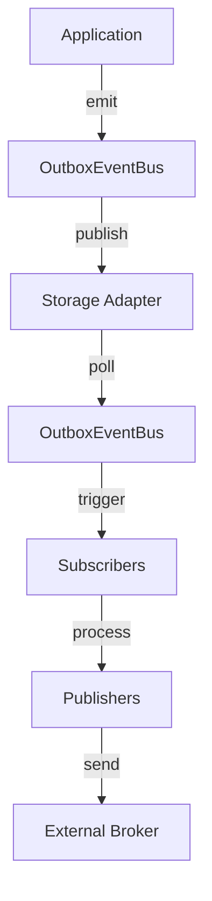

# outbox-event-bus


> **Never Lose an Event Again**
>
> `outbox-event-bus` guarantees reliable, at-least-once event delivery using the Transactional Outbox Pattern.

## Quick Start

```bash
npm install outbox-event-bus @outbox-event-bus/postgres-drizzle-outbox @outbox-event-bus/sqs-publisher
```

```typescript
import { drizzle } from 'drizzle-orm/postgres-js';
import postgres from 'postgres';
import { SQSClient } from '@aws-sdk/client-sqs';
import { OutboxEventBus } from 'outbox-event-bus';
import { PostgresDrizzleOutbox } from '@outbox-event-bus/postgres-drizzle-outbox';
import { SQSPublisher } from '@outbox-event-bus/sqs-publisher';

// Setup outbox with PostgreSQL (one of several built-in adapters)
const client = postgres(process.env.DATABASE_URL!);
const db = drizzle(client);
const outbox = new PostgresDrizzleOutbox({
  db,
  onError: (error) => console.error('Outbox error:', error)
});

// Create event bus
const bus = new OutboxEventBus(
  outbox,
  (bus, eventType, count) => console.warn(`Max listeners: ${eventType}`),
  (error) => console.error('Bus error:', error)
);

// Subscribe to events
bus.on('user.created', async (event) => {
  console.log('User created:', event.payload);
});

// Emit events - they're persisted before processing
await bus.emit({ 
  id: crypto.randomUUID(), 
  type: 'user.created', 
  payload: { userId: '123' }, 
});

// Setup SQS publisher (one of several built-in publishers)
const publisher = new SQSPublisher(bus, {
  sqsClient: new SQSClient({ region: 'us-east-1' }),
  queueUrl: 'https://sqs.us-east-1.amazonaws.com/12345/my-queue',
  onError: (error) => console.error('SQS error:', error)
});
publisher.subscribe(['user.created', .'order.placed']);

// Start processing
bus.start();
```

**What makes this different?** Events are persisted to your database before processing, ensuring they're never lost—even if your application crashes mid-execution.

---

- [The Problem](#the-problem)
- [The Solution](#the-solution)
- [Philosophy](#philosophy)
- [Installation](#installation)
- [Core Concepts](#core-concepts)
- [Adapters](#adapters)
- [Publishers](#publishers)
- [API Reference](#api-reference)
- [Development](#development)
- [Architecture](#architecture)
- [License](#license)

---

## The Problem

In distributed systems, **events get lost**. Traditional event emitters fail silently when:

1. **Your application crashes** before the event handler completes.
2. **The database transaction rolls back** but the event was already emitted.
3. **Network failures** occur during message broker communication.
4. **Race conditions** cause events to be processed out of order.

```typescript
// BEFORE: Traditional EventEmitter - Events can be lost
emitter.emit('user.created', user); // 💥 Lost if app crashes
```

## The Solution

`outbox-event-bus` makes event delivery reliable by treating events as data.

1. **Persist** events to your database atomically with your business logic.
2. **Poll** the outbox table for pending events.
3. **Process** events with automatic retries and recovery.
4. **Guarantee** at-least-once delivery—no event is ever lost.

```typescript
// AFTER: Outbox Event Bus - Events are never lost
await bus.emit({ type: 'user.created', payload: user }); // ✅ Guaranteed delivery
```

## Philosophy

- **Durability First** - Persist before process. Events are data, not ephemeral signals.
- **At-Least-Once Delivery** - Accept idempotency requirements in exchange for guaranteed delivery.
- **Explicit Failure Handling** - Retries, backoff, and recovery are built-in.
- **Production-Ready** - Designed for distributed systems with horizontal scaling and stuck event recovery.

## Installation

Install the core library:
```bash
npm install outbox-event-bus
```

Choose your **Storage Adapter**:
- [DynamoDB](https://github.com/dunikax/outbox-event-bus/tree/main/adapters/dynamodb)
- [MongoDB](https://github.com/dunikax/outbox-event-bus/tree/main/adapters/mongo)
- [Postgres (Drizzle)](https://github.com/dunikax/outbox-event-bus/tree/main/adapters/postgres-drizzle)
- [Postgres (Prisma)](https://github.com/dunikax/outbox-event-bus/tree/main/adapters/postgres-prisma)
- [Redis](https://github.com/dunikax/outbox-event-bus/tree/main/adapters/redis)
- [SQLite](https://github.com/dunikax/outbox-event-bus/tree/main/adapters/sqlite)

Choose your **Message Publisher**:
- [EventBridge](https://github.com/dunikax/outbox-event-bus/tree/main/publishers/eventbridge)
- [RabbitMQ](https://github.com/dunikax/outbox-event-bus/tree/main/publishers/rabbitmq)
- [Redis Streams](https://github.com/dunikax/outbox-event-bus/tree/main/publishers/redis-streams)
- [SNS](https://github.com/dunikax/outbox-event-bus/tree/main/publishers/sns)
- [SQS](https://github.com/dunikax/outbox-event-bus/tree/main/publishers/sqs)
- [Kafka](https://github.com/dunikax/outbox-event-bus/tree/main/publishers/kafka)

## Core Concepts

### Outbox
The storage backend (Database, Redis, etc.) that persists events and manages their lifecycle.

### Event Bus
The main orchestrator that provides an EventEmitter-like API for emitting and subscribing to events.

### Publisher
A specialized subscriber that forwards events to external systems (brokers, webhooks, etc.).

## API Reference

### OutboxEventBus

The main event bus class that coordinates event emission and subscription. It provides an API that is nearly at parity with Node.js's native [EventEmitter](https://nodejs.org/api/events.html#class-eventemitter), making it familiar and easy to use.

#### Constructor

```typescript
new OutboxEventBus(
  outbox: IOutbox,
  onMaxListeners: (bus: OutboxEventBus, eventType: string, count: number) => void,
  onError: (error: unknown) => void
)
```

#### Methods

##### Event Emission

```typescript
// Emit a single event
await bus.emit<T extends string, P>(event: BusEvent<T, P>): Promise<void>

// Emit multiple events
await bus.emitMany<T extends string, P>(events: BusEvent<T, P>[]): Promise<void>
```

##### Event Subscription

```typescript
// Subscribe to an event type
bus.on<T extends string, P>(eventType: T, handler: EventHandler<T, P>): this

// Subscribe to multiple event types
bus.subscribe<T extends string, P>(eventTypes: T[], handler: EventHandler<T, P>): this

// Subscribe once (auto-unsubscribe after first event)
bus.once<T extends string, P>(eventType: T, handler: EventHandler<T, P>): this

// Prepend listener (execute before existing listeners)
bus.prependListener<T extends string, P>(eventType: T, handler: EventHandler<T, P>): this
bus.prependOnceListener<T extends string, P>(eventType: T, handler: EventHandler<T, P>): this
```

##### Event Unsubscription

```typescript
// Remove a specific handler
bus.off<T extends string, P>(eventType: T | T[], handler: EventHandler<T, P>): this
bus.removeListener<T extends string, P>(eventType: T | T[], handler: EventHandler<T, P>): this

// Remove all handlers for an event type
bus.removeAllListeners<T extends string>(eventType?: T): this
```

##### Lifecycle

```typescript
// Start processing events from the outbox
bus.start(): void

// Stop processing events
await bus.stop(): Promise<void>
```

##### Utilities

```typescript
// Wait for a specific event (with timeout)
await bus.waitFor<T extends string, P>(eventType: T, timeoutMs?: number): Promise<BusEvent<T, P>>

// Get listener count for an event type
bus.listenerCount(eventType: string): number

// Get all event types with listeners
bus.eventNames(): string[]

// Get total subscription count
bus.getSubscriptionCount(): number

// Set max listeners per event type
bus.setMaxListeners(n: number): this

// Get raw listeners for an event type
bus.rawListeners(eventType: string): AnyListener[]
```

### BusEvent

Event structure:

```typescript
interface BusEvent<T extends string = string, P = unknown> {
  id: string;           // Unique event ID
  type: T;              // Event type (e.g., 'user.created')
  payload: P;           // Event payload
  occurredAt?: Date;    // When the event occurred (automatically added if not provided)
  metadata?: Record<string, unknown>; // Optional metadata
}
```

### EventHandler

Event handler function signature:

```typescript
type EventHandler<T extends string, P> = (event: BusEvent<T, P>) => Promise<void>
```

## Development

This project is a monorepo managed with **pnpm**.

### Clone and Install
```bash
git clone https://github.com/dunikax/outbox-event-bus.git
cd outbox-event-bus
pnpm install
```

### Build
```bash
pnpm build
```

### Test
```bash
pnpm test

pnpm test:e2e
```

### Lint
```bash
pnpm lint
```

## Architecture



## License

MIT
