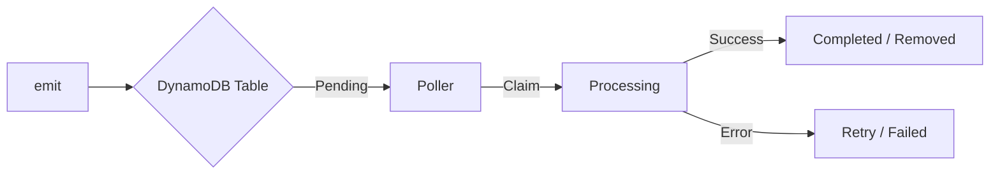

# DynamoDB AWS SDK Outbox Adapter


> **Reliable, Serverless-First Event Storage for DynamoDB**

The DynamoDB adapter for `outbox-event-bus` provides a high-performance, resilient outbox implementation designed specifically for AWS environments. It leverages DynamoDB's native scalability, TTL features, and Global Secondary Indices (GSIs) to ensure zero event loss even under intense load.

---

## How it Works

The adapter persists events in a DynamoDB table and uses a Global Secondary Index (GSI) to efficiently track event progression.



### Why DynamoDB?
- **Zero Connection Pools**: Unlike RDS, DynamoDB handles HTTP connections natively—perfect for AWS Lambda.
- **Auto-Scaling**: Seamlessly scales from 0 to millions of events without managing IOPS.
- **Fine-Grained IAM**: Security-first approach with native AWS authentication.

---

## Quick Start

### 1. Installation

```bash
npm install @outbox-event-bus/dynamodb-aws-sdk-outbox
```

### 2. Prepare Your Table

Create a DynamoDB table with an `id` partition key and a GSI for status tracking.

| Component | Attribute | Type | Detail |
| :--- | :--- | :--- | :--- |
| **Table PK** | `id` | String | Unique Event ID |
| **GSI PK** | `status` | String | `created`, `active`, etc. |
| **GSI SK** | `gsiSortKey` | Number | Unix timestamp for ordering |

### 3. Initialize & Start

```typescript
import { DynamoDBClient } from '@aws-sdk/client-dynamodb';
import { DynamoDBAwsSdkOutbox } from '@outbox-event-bus/dynamodb-aws-sdk-outbox';
import { OutboxEventBus } from 'outbox-event-bus';

const outbox = new DynamoDBAwsSdkOutbox({
  client: new DynamoDBClient({ region: 'us-east-1' }),
  tableName: 'my-events-table',
  statusIndexName: 'status-gsiSortKey-index' // Name of your GSI
});

const bus = new OutboxEventBus(outbox, (error: OutboxError) => {
  const event = error.context?.event;
  console.error('Event failed:', event?.type, error);
});

bus.start();
```

---

## Feature Highlights

- **Atomic Transactions**: Emit events and update your business data in a single atomic operation.
- **Optimistic Locking**: Guarantees "at-least-once" delivery without double-processing, even with multiple workers.
- **Zombie Recovery**: Automatically detects and restarts events that got stuck due to Lambda timeouts or crashes.
- **Batch Processing**: Groups event updates into efficient `BatchWriteItem` requests.

---

## Concurrency & Locking

This adapter uses **Optimistic Locking** via Conditional Writes to ensure safe concurrent processing.

-   **Atomic Claims**: The adapter uses `ConditionExpression` (e.g., `attribute_not_exists(locked_by)`) to claim events.
-   **Multiple Workers**: You can safely run multiple instances (e.g., Lambda functions).
-   **No Duplicates**: DynamoDB guarantees that only one worker can successfully claim a specific event.

## How-to Guides

### Transactional Writes (AsyncLocalStorage)

The recommended way to use the outbox is with `AsyncLocalStorage`. This allows you to collect multiple database operations and an event into a single atomic transaction.

```typescript
import { TransactWriteCommand } from '@aws-sdk/lib-dynamodb';
import { AsyncLocalStorage } from 'node:async_hooks';

const als = new AsyncLocalStorage<any>();
const outbox = new DynamoDBAwsSdkOutbox({
  client,
  tableName: 'events',
  getCollector: () => als.getStore() // Link the outbox to the current store
});

async function createUser(user: any) {
  const transactionItems: any[] = [];
  
  await als.run({ push: (item) => transactionItems.push(item) }, async () => {
    // 1. Business Logic
    transactionItems.push({ Put: { TableName: 'Users', Item: user } });

    // 2. Emit Event (automatically attached to transactionItems via collector)
    await bus.emit({ id: '...', type: 'user.created', payload: user });

    // 3. Commit
    await client.send(new TransactWriteCommand({ TransactItems: transactionItems }));
  });
}
```

### Manual Transaction Collection

If you prefer explicit over implicit, you can pass a collection array directly.

```typescript
const items: any[] = [];
items.push({ Put: { TableName: 'Data', Item: { id: 1 } } });

// The second argument is the collector
await bus.emit({ type: 'item.updated', payload: { id: 1 } }, items);

await client.send(new TransactWriteCommand({ TransactItems: items }));
```

---

## Configuration Reference

### `DynamoDBAwsSdkOutboxConfig`

```typescript
interface DynamoDBAwsSdkOutboxConfig extends OutboxConfig {
  // DynamoDB-specific options
  client: DynamoDBClient;              // AWS SDK v3 Client instance
  tableName: string;                   // DynamoDB table name
  statusIndexName?: string;            // GSI name (default: 'status-gsiSortKey-index')
  getCollector?: () => any[] | undefined; // Transaction collector getter
  // Inherited from OutboxConfig
  batchSize?: number;                  // Events per poll (default: 50)
  pollIntervalMs?: number;             // Polling interval (default: 1000ms)
  processingTimeoutMs?: number;        // Processing timeout (default: 30000ms)
  maxRetries?: number;                 // Max retry attempts (default: 5)
  baseBackoffMs?: number;              // Base backoff delay (default: 1000ms)
  maxErrorBackoffMs?: number;          // Max polling error backoff (default: 30000ms)
}
```

> [!NOTE]
> All adapters inherit base configuration options from `OutboxConfig`. See the [API Reference](https://github.com/dunika/outbox-event-bus/blob/main/docs/API_REFERENCE.md#base-outbox-configuration) for details on inherited options.

| Option | Type | Default | Description |
| :--- | :--- | :--- | :--- |
| `client` | `DynamoDBClient` | **Required** | AWS SDK v3 Client instance. |
| `tableName` | `string` | **Required** | The DynamoDB table name. |
| `statusIndexName` | `string` | `'status-gsiSortKey-index'` | The name of the GSI used for polling. |
| `getCollector` | `() => any[] \| undefined` | - | Transaction collector getter for atomic writes. |
| `batchSize` | `number` | `50` | Number of events to claim per poll. |
| `pollIntervalMs` | `number` | `1000` | Delay between poll cycles. |
| `processingTimeoutMs`| `number` | `30000` | After this time, a 'PROCESSING' event is considered stuck. |
| `maxRetries` | `number` | `5` | Maximum attempts for a failed event. |
| `baseBackoffMs` | `number` | `1000` | Base delay for exponential backoff. |
| `maxErrorBackoffMs` | `number` | `30000` | Maximum backoff delay after polling errors. |

---

## API Reference

### `DynamoDBAwsSdkOutbox`

```typescript
class DynamoDBAwsSdkOutbox implements IOutbox<any[]>
```

#### Constructor

```typescript
constructor(config: DynamoDBAwsSdkOutboxConfig)
```

Creates a new DynamoDB outbox adapter using AWS SDK v3.

**Parameters:**
- `config`: Configuration object (see [Configuration Reference](#configuration-reference))

**Example:**
```typescript
const outbox = new DynamoDBAwsSdkOutbox({
  client: new DynamoDBClient({ region: 'us-east-1' }),
  tableName: 'my-events-table',
  statusIndexName: 'status-index',
  batchSize: 100
});
```

---

#### Methods

##### `publish(events: BusEvent[], transaction?: any[]): Promise<void>`

Publishes events to the outbox. If a `transaction` collector array is provided, events are added to it for atomic writes. Otherwise, events are written immediately.

**Parameters:**
- `events`: Array of events to publish
- `transaction`: Optional collector array for TransactWriteCommand

**Example:**
```typescript
// Direct publish
await outbox.publish([
  { id: '1', type: 'user.created', payload: user, occurredAt: new Date() }
]);

// With transaction collector
const items: any[] = [];
await outbox.publish([event], items);
await client.send(new TransactWriteCommand({ TransactItems: items }));
```

---

##### `getFailedEvents(): Promise<FailedBusEvent[]>`

Retrieves up to 100 failed events, ordered by occurrence time (newest first).

**Returns:** Array of `FailedBusEvent` objects with error details and retry count.

**Example:**
```typescript
const failed = await outbox.getFailedEvents();
for (const event of failed) {
  console.log(`Event ${event.id} failed ${event.retryCount} times`);
  console.log(`Last error: ${event.error}`);
}
```

---

##### `retryEvents(eventIds: string[]): Promise<void>`

Resets failed events to `created` status for retry. Clears retry count, error message, and next retry timestamp.

**Parameters:**
- `eventIds`: Array of event IDs to retry

**Example:**
```typescript
const failed = await outbox.getFailedEvents();
await outbox.retryEvents(failed.map(e => e.id));
```

---

##### `start(handler: (event: BusEvent) => Promise<void>, onError: ErrorHandler): void`

Starts the polling service to process events.

**Parameters:**
- `handler`: Async function to process each event
- `onError`: Error handler called when event processing fails

**Example:**
```typescript
outbox.start(
  async (event) => {
    console.log('Processing:', event);
    // Your event handling logic
  },
  (err, event) => {
    console.error('Failed to process event:', err, event);
  }
);
```

---

##### `stop(): Promise<void>`

Stops the polling service gracefully and waits for in-flight events to complete.

**Example:**
```typescript
await outbox.stop();
```

---

## IAM Permissions

Your application's IAM role needs the following permissions:

```json
{
  "Version": "2012-10-17",
  "Statement": [
    {
      "Effect": "Allow",
      "Action": ["dynamodb:PutItem", "dynamodb:GetItem", "dynamodb:UpdateItem"],
      "Resource": "arn:aws:dynamodb:*:*:table/YOUR_TABLE/index/YOUR_GSI"
    },
    {
      "Effect": "Allow",
      "Action": ["dynamodb:Query"],
      "Resource": "arn:aws:dynamodb:*:*:table/YOUR_TABLE/index/YOUR_GSI"
    }
  ]
}
```

---

## Troubleshooting

### Events Not Moving

**Symptom**: Events are stuck in `created` status and never get processed.

**Causes**:
1. `statusIndexName` doesn't match the actual GSI name in DynamoDB
2. GSI not created or still being built
3. Polling service not started

**Solution**:
```typescript
// 1. Verify GSI name matches
const outbox = new DynamoDBAwsSdkOutbox({
  client,
  tableName: 'my-events',
  statusIndexName: 'status-gsiSortKey-index' // Must match actual GSI name
});

// 2. Check GSI status in AWS Console or CLI
// aws dynamodb describe-table --table-name my-events

// 3. Ensure bus is started
bus.start();
```

---

### ConditionalCheckFailedException

**Symptom**: Seeing `ConditionalCheckFailedException` errors in logs.

**Cause**: Multiple workers trying to claim the same event simultaneously (expected behavior).

**Solution**: This is **normal and expected**! The adapter uses optimistic locking to prevent duplicate processing. The error means another worker successfully claimed the event first. No action needed—the adapter handles this gracefully.

---

### Slow Polling / High Latency

**Symptom**: Events take a long time to process after being emitted.

**Causes**:
1. Low Read Capacity Units (RCU) on the GSI
2. Small `batchSize` setting
3. Long `pollIntervalMs`

**Solution**:
```typescript
// 1. Increase batch size for higher throughput
const outbox = new DynamoDBAwsSdkOutbox({
  client,
  tableName: 'events',
  batchSize: 100, // Process more events per poll (default: 50)
  pollIntervalMs: 500 // Poll more frequently (default: 1000ms)
});

// 2. Check and increase RCU on your GSI in AWS Console
// Recommended: Use On-Demand billing mode for auto-scaling
```

---

### Duplicate Event Processing

**Symptom**: Event handlers are being called multiple times for the same event.

**Cause**: The outbox guarantees "at-least-once" delivery. Duplicates can occur due to:
- Worker crashes during processing
- Network timeouts
- Publisher retries

**Solution**: Make your event handlers **idempotent**:
```typescript
bus.on('order.created', async (event) => {
  // Use event ID for deduplication
  const existing = await db.getOrder(event.payload.orderId);
  if (existing) {
    console.log('Order already processed, skipping');
    return;
  }
  
  await db.createOrder(event.payload);
});
```

---

### ProvisionedThroughputExceededException

**Symptom**: `ProvisionedThroughputExceededException` errors during high load.

**Cause**: Write or read capacity exceeded on table or GSI.

**Solution**:
```typescript
// Option 1: Switch to On-Demand billing mode (recommended)
// aws dynamodb update-table --table-name events --billing-mode PAY_PER_REQUEST

// Option 2: Increase provisioned capacity
// aws dynamodb update-table --table-name events \
//   --provisioned-throughput ReadCapacityUnits=100,WriteCapacityUnits=100

// Option 3: Reduce polling frequency temporarily
const outbox = new DynamoDBAwsSdkOutbox({
  client,
  tableName: 'events',
  pollIntervalMs: 2000, // Reduce polling frequency
  batchSize: 25 // Reduce batch size
});
```

---

### Events Stuck in active

**Symptom**: Events remain in `active` status indefinitely.

**Cause**: Worker crashed or Lambda timed out during processing.

**Solution**: The adapter automatically recovers stuck events based on `processingTimeoutMs`. To force immediate recovery:

```typescript
// Stuck events are automatically reclaimed after processingTimeoutMs
const outbox = new DynamoDBAwsSdkOutbox({
  client,
  tableName: 'events',
  processingTimeoutMs: 30000 // Adjust based on handler complexity (default: 30s)
});

// Manual recovery: Query and reset stuck events
const response = await client.send(new QueryCommand({
  TableName: 'events',
  IndexName: 'status-gsiSortKey-index',
  KeyConditionExpression: "#status = :active AND gsiSortKey <= :now",
  ExpressionAttributeNames: { 
    "#status": "status"
  },
  ExpressionAttributeValues: {
    ":active": { S: 'active' },
    ":now": { N: String(Date.now()) }
  }
}));
```
