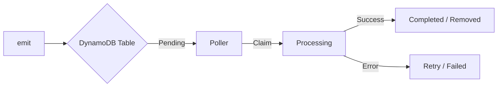

# DynamoDB AWS SDK Outbox Adapter

<div align="left">
  
  
</div>

**Reliable, Serverless-First Event Storage for DynamoDB.**

The DynamoDB adapter for `outbox-event-bus` provides a high-performance, resilient outbox implementation designed specifically for AWS environments. It leverages DynamoDB's native scalability, TTL features, and Global Secondary Indices (GSIs) to ensure zero event loss even under intense load.

---

## 🏗️ How it Works

The adapter persists events in a DynamoDB table and uses a Global Secondary Index (GSI) to efficiently track event progression.



### Why DynamoDB?
- **Zero Connection Pools**: Unlike RDS, DynamoDB handles HTTP connections natively—perfect for AWS Lambda.
- **Auto-Scaling**: Seamlessly scales from 0 to millions of events without managing IOPS.
- **Fine-Grained IAM**: Security-first approach with native AWS authentication.

---

## 🚀 Quick Start

### 1. Installation

```bash
npm install @outbox-event-bus/dynamodb-aws-sdk-outbox
```

### 2. Prepare Your Table

Create a DynamoDB table with an `id` partition key and a GSI for status tracking.

| Component | Attribute | Type | Detail |
| :--- | :--- | :--- | :--- |
| **Table PK** | `id` | String | Unique Event ID |
| **GSI PK** | `status` | String | `PENDING`, `PROCESSING`, etc. |
| **GSI SK** | `gsiSortKey` | Number | Unix timestamp for ordering |

### 3. Initialize & Start

```typescript
import { DynamoDBClient } from '@aws-sdk/client-dynamodb';
import { DynamoDBAwsSdkOutbox } from '@outbox-event-bus/dynamodb-aws-sdk-outbox';
import { OutboxEventBus } from 'outbox-event-bus';

const outbox = new DynamoDBAwsSdkOutbox({
  client: new DynamoDBClient({ region: 'us-east-1' }),
  tableName: 'my-events-table',
  statusIndexName: 'status-index' // Name of your GSI
});

const bus = new OutboxEventBus(outbox, (err) => console.error(err));
bus.start();
```

---

## 📖 Feature Highlights

- **Atomic Transactions**: Emit events and update your business data in a single atomic operation.
- **Optimistic Locking**: Guarantees "at-least-once" delivery without double-processing, even with multiple workers.
- **Zombie Recovery**: Automatically detects and restarts events that got stuck due to Lambda timeouts or crashes.
- **Batch Processing**: Groups event updates into efficient `BatchWriteItem` requests.

---

## 🛠️ How-to Guides

### Transactional Writes (AsyncLocalStorage)

The recommended way to use the outbox is with `AsyncLocalStorage`. This allows you to collect multiple database operations and an event into a single atomic transaction.

```typescript
import { TransactWriteCommand } from '@aws-sdk/lib-dynamodb';
import { AsyncLocalStorage } from 'node:async_hooks';

const als = new AsyncLocalStorage<any>();
const outbox = new DynamoDBAwsSdkOutbox({
  client,
  tableName: 'events',
  getCollector: () => als.getStore() // Link the outbox to the current store
});

async function createUser(user: any) {
  const transactionItems: any[] = [];
  
  await als.run({ push: (item) => transactionItems.push(item) }, async () => {
    // 1. Business Logic
    transactionItems.push({ Put: { TableName: 'Users', Item: user } });

    // 2. Emit Event (automatically attached to transactionItems via collector)
    await bus.emit({ id: '...', type: 'user.created', payload: user });

    // 3. Commit
    await client.send(new TransactWriteCommand({ TransactItems: transactionItems }));
  });
}
```

### Manual Transaction Collection

If you prefer explicit over implicit, you can pass a collection array directly.

```typescript
const items: any[] = [];
items.push({ Put: { TableName: 'Data', Item: { id: 1 } } });

// The second argument is the collector
await bus.emit({ type: 'item.updated', payload: { id: 1 } }, items);

await client.send(new TransactWriteCommand({ TransactItems: items }));
```

---

## ⚙️ Configuration Reference

### `DynamoDBAwsSdkOutboxConfig`

| Option | Type | Default | Description |
| :--- | :--- | :--- | :--- |
| `client` | `DynamoDBClient` | **Required** | AWS SDK v3 Client instance. |
| `tableName` | `string` | **Required** | The DynamoDB table name. |
| `statusIndexName` | `string` | `'status-gsiSortKey-index'` | The name of the GSI used for polling. |
| `batchSize` | `number` | `50` | Number of events to claim per poll. |
| `pollIntervalMs` | `number` | `1000` | Delay between poll cycles. |
| `processingTimeoutMs`| `number` | `30000` | After this time, a 'PROCESSING' event is considered stuck. |
| `maxRetries` | `number` | `5` | Maximum attempts for a failed event. |
| `baseBackoffMs` | `number` | `1000` | Base delay for exponential backoff. |

---

## 🛡️ IAM Permissions

Your application's IAM role needs the following permissions:

```json
{
  "Version": "2012-10-17",
  "Statement": [
    {
      "Effect": "Allow",
      "Action": ["dynamodb:PutItem", "dynamodb:GetItem", "dynamodb:UpdateItem"],
      "Resource": "arn:aws:dynamodb:*:*:table/YOUR_TABLE"
    },
    {
      "Effect": "Allow",
      "Action": ["dynamodb:Query"],
      "Resource": "arn:aws:dynamodb:*:*:table/YOUR_TABLE/index/YOUR_GSI"
    }
  ]
}
```

---

## ❓ Troubleshooting

> [!TIP]
> **Events are not moving?** Check if your `statusIndexName` matches the actual GSI name in AWS. The poller relies entirely on this index.

> [!IMPORTANT]
> **ConditionalCheckFailedException?** This is expected! It means another worker tried to claim the same event at the exact same millisecond. The adapter handles this gracefully.

- **Slow Polling**: Increase `batchSize` or check if your RCU (Read Capacity Units) on the GSI is too low.
- **Duplicate Events**: Ensure your publisher (SQS/Kafka) is idempotent or that your handlers handle duplicates. The outbox guarantees "at-least-once" delivery.

---

<div align="center">
  Built with ❤️ for the AWS Community.
</div>

