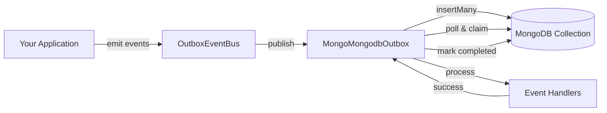

# MongoDB Adapter


> **Transactional Event Persistence for MongoDB**  
> Leverage MongoDB's ACID transactions and flexible document model to reliably persist and process events with the Outbox pattern.

MongoDB adapter for [outbox-event-bus](https://github.com/dunika/outbox-event-bus#readme). Provides reliable, transactional event storage using MongoDB's native transactions and optimistic locking via `findOneAndUpdate`.

---

## Quick Start

```bash
npm install @outbox-event-bus/mongo-mongodb-outbox
```

```typescript
import { MongoClient } from 'mongodb';
import { MongoMongodbOutbox } from '@outbox-event-bus/mongo-mongodb-outbox';
import { OutboxEventBus } from 'outbox-event-bus';

const client = new MongoClient('mongodb://localhost:27017');
await client.connect();

const outbox = new MongoMongodbOutbox({
  client,
  dbName: 'myapp',
  collectionName: 'outbox_events' // optional, defaults to 'outbox_events'
});

const bus = new OutboxEventBus(outbox, (error) => console.error(error));
bus.start();

// Emit events
await bus.emit({
  id: crypto.randomUUID(),
  type: 'order.created',
  payload: { orderId: '123', amount: 99.99 }
});
```

---

## When to Use

**Choose MongoDB Outbox when:**

- You are already using **MongoDB** in your stack
- You need to store **complex, nested event payloads** without serialization overhead
- You want **flexible schema** evolution for events
- You need deep **query capabilities** on event history (e.g., analytics, debugging)
- You require **ACID transactions** with MongoDB replica sets

**Consider alternatives if:**

- You need the absolute lowest latency (Redis may be faster for in-memory workloads)
- You're not using MongoDB and don't want to add it as a dependency

---

## Architecture



The MongoDB adapter:
1. **Publishes** events to a dedicated collection (default: `outbox_events`)
2. **Polls** for pending events at a configurable interval
3. **Claims** events atomically using `findOneAndUpdate` to prevent double-processing
4. **Processes** events and marks them as `completed` or `failed`
5. **Retries** failed events with exponential backoff

---

## Concurrency & Locking

This adapter uses **Optimistic Locking** via `findOneAndUpdate` to ensure safe concurrent processing.

-   **Atomic Claims**: The adapter atomically finds a 'created' event and updates its status to 'active' in a single operation.
-   **Multiple Workers**: You can safely run multiple instances of your application.
-   **No Duplicates**: MongoDB guarantees that only one worker can successfully claim a specific event.

## Usage

### Basic Setup

```typescript
import { MongoClient } from 'mongodb';
import { MongoMongodbOutbox } from '@outbox-event-bus/mongo-mongodb-outbox';
import { OutboxEventBus } from 'outbox-event-bus';

const client = new MongoClient('mongodb://localhost:27017');
await client.connect();

const outbox = new MongoMongodbOutbox({
  client,
  dbName: 'myapp'
});

const bus = new OutboxEventBus(outbox, (error) => console.error(error));
bus.start();
```

### With Transactions (AsyncLocalStorage)

Use `AsyncLocalStorage` to manage MongoDB `ClientSession` across your application, ensuring events are only persisted if the session transaction commits.

```typescript
import { MongoClient, ClientSession } from 'mongodb';
import { AsyncLocalStorage } from 'node:async_hooks';
import { MongoMongodbOutbox } from '@outbox-event-bus/mongo-mongodb-outbox';
import { OutboxEventBus } from 'outbox-event-bus';

const client = new MongoClient('mongodb://localhost:27017');
const als = new AsyncLocalStorage<ClientSession>();

// Helper to get session from ALS
function getMongodbSession() {
  return () => als.getStore();
}

const outbox = new MongoMongodbOutbox({
  client,
  dbName: 'myapp',
  getSession: getMongodbSession()
});

const bus = new OutboxEventBus(outbox, (error) => console.error(error));
bus.start();

async function createOrder(orderData: any) {
  const session = client.startSession();
  try {
    await session.withTransaction(async () => {
      await als.run(session, async () => {
        // 1. Save business data
        await client.db('myapp').collection('orders').insertOne(orderData, { session });

        // 2. Emit event (automatically uses session from ALS via getSession)
        await bus.emit({
          id: crypto.randomUUID(),
          type: 'order.created',
          payload: orderData
        });
      });
    });
  } finally {
    await session.endSession();
  }
}
```

### With Transactions (Explicit)

You can also pass the MongoDB `ClientSession` explicitly to `emit`.

```typescript
const session = client.startSession();
await session.withTransaction(async () => {
  await client.db('myapp').collection('orders').insertOne(orderData, { session });

  await bus.emit({
    id: crypto.randomUUID(),
    type: 'order.created',
    payload: orderData
  }, session); // Pass the session explicitly
});
session.endSession();
```

### With Replica Set

MongoDB transactions require a replica set. Configure your connection string accordingly:

```typescript
const client = new MongoClient(
  'mongodb://mongo1,mongo2,mongo3/myapp?replicaSet=rs0&w=majority'
);
```

---

## API Reference

### `MongoMongodbOutbox`

The MongoDB adapter for the Outbox Event Bus.

#### Constructor

```typescript
new MongoMongodbOutbox(config: MongoMongodbOutboxConfig)
```

#### `MongoMongodbOutboxConfig`

```typescript
interface MongoMongodbOutboxConfig {
  client: MongoClient;                           // MongoDB client instance
  dbName: string;                                // Database name
  collectionName?: string;                       // Collection name (default: 'outbox_events')
  maxRetries?: number;                           // Max retry attempts (default: 5)
  baseBackoffMs?: number;                        // Base backoff (default: 1000ms)
  pollIntervalMs?: number;                       // Polling interval (default: 1000ms)
  maxErrorBackoffMs?: number;                    // Max polling error backoff (default: 30000ms)
  processingTimeoutMs?: number;                  // Processing timeout (default: 30000ms)
  batchSize?: number;                            // Events per poll (default: 50)
  getSession?: () => ClientSession | undefined;  // Session getter for ALS
}
```

> [!NOTE]
> All adapters inherit base configuration options from `OutboxConfig`. See the [API Reference](https://github.com/dunika/outbox-event-bus/blob/main/docs/API_REFERENCE.md#base-outbox-configuration) for details on inherited options.

| Property | Type | Required | Default | Description |
|----------|------|----------|---------|-------------|
| `client` | `MongoClient` | ✅ | - | MongoDB client instance |
| `dbName` | `string` | ✅ | - | Database name |
| `collectionName` | `string` | ❌ | `'outbox_events'` | Collection name for outbox events |
| `maxRetries` | `number` | ❌ | `5` | Maximum retry attempts for failed events |
| `baseBackoffMs` | `number` | ❌ | `1000` | Base delay for exponential backoff (ms). |
| `maxErrorBackoffMs` | `number` | ❌ | `30000` | Maximum backoff delay after polling errors (ms). |
| `pollIntervalMs` | `number` | ❌ | `1000` | Polling interval in milliseconds |
| `processingTimeoutMs` | `number` | ❌ | `30000` | Processing timeout in milliseconds |
| `batchSize` | `number` | ❌ | `50` | Number of events to claim per poll |
| `getSession` | `() => ClientSession \| undefined` | ❌ | `undefined` | Function to retrieve the current MongoDB session (for ALS) |

#### Methods

##### `publish(events: BusEvent[], transaction?: ClientSession): Promise<void>`

Publishes events to the outbox collection. If a `transaction` is provided (or retrieved via `getSession`), events are inserted within that transaction.

##### `getFailedEvents(): Promise<FailedBusEvent[]>`

Returns up to 100 failed events, sorted by `occurredAt` (descending).

##### `retryEvents(eventIds: string[]): Promise<void>`

Resets the specified events to `created` status, allowing them to be retried.

##### `start(handler: (event: BusEvent) => Promise<void>, onError: ErrorHandler): void`

Starts the polling service to process events.

##### `stop(): Promise<void>`

Stops the polling service gracefully.

---

### Required Document Fields

If you are using a custom collection, it **must** support documents with the following fields:

| Field | MongoDB Type | Required | Description |
|:---|:---|:---:|:---|
| `_id` | `String` or `ObjectId` | ✅ | Unique event ID |
| `type` | `String` | ✅ | Event type string |
| `payload` | `Object` | ✅ | Event data (any valid BSON) |
| `occurredAt` | `Date` | ✅ | When event occurred |
| `status` | `String` | ✅ | `created`, `active`, `completed`, `failed` |
| `retryCount` | `Int` | ✅ | Current retry attempts |
| `lastError` | `String` | ❌ | Last error message |
| `nextRetryAt` | `Date` | ❌ | Scheduled retry time |
| `createdOn` | `Date` | ✅ | Document creation time |
| `startedOn` | `Date` | ❌ | Processing start time |
| `keepAlive` | `Date` | ❌ | Heartbeat for stuck detection |
| `expireInSeconds` | `Int` | ✅ | Default: 30 |

> [!TIP]
> Ensure you have an index on `{ status: 1, nextRetryAt: 1 }` and `{ status: 1, keepAlive: 1 }` for optimal polling performance.

---

## Features

### ✅ Atomic Locking

Uses `findOneAndUpdate` to atomically claim events, preventing double-processing across multiple workers.

### ✅ Stuck Event Recovery

Automatically recovers events that have been in `active` state for too long (based on `keepAlive` timestamp and `expireInSeconds`).

### ✅ Nested Payloads

Fully supports arbitrary JSON payloads without serialization overhead. Store complex, nested documents directly.

### ✅ Transactional Consistency

When used with MongoDB transactions, events are only persisted if the transaction commits, ensuring consistency between your business data and events.

### ✅ Exponential Backoff

Failed events are retried with exponential backoff, reducing load on downstream systems.

---

## Production Checklist

Before deploying to production, ensure the following:

### 1. **Use a Replica Set**

MongoDB transactions require a replica set. Configure your connection string accordingly:

```typescript
const client = new MongoClient(
  'mongodb://mongo1,mongo2,mongo3/myapp?replicaSet=rs0&w=majority'
);
```

### 2. **Create Indexes**

Ensure the recommended indexes are created for optimal performance:

```javascript
db.outbox_events.createIndex({ status: 1, nextRetryAt: 1 });
db.outbox_events.createIndex({ status: 1, keepAlive: 1 });
db.outbox_events.createIndex({ eventId: 1 }, { unique: true });
```

### 3. **Configure Write Concern**

Use `w: 'majority'` to ensure writes are acknowledged by a majority of replica set members:

```typescript
const client = new MongoClient(
  'mongodb://localhost:27017?w=majority'
);
```

### 4. **Monitor Connection Pool**

Tune `minPoolSize` and `maxPoolSize` based on your concurrency requirements:

```typescript
const client = new MongoClient('mongodb://localhost:27017', {
  minPoolSize: 10,
  maxPoolSize: 100
});
```

### 5. **Set Up Monitoring**

Monitor the following metrics:
- **Event processing lag**: Time between `occurredAt` and `completedOn`
- **Failed events**: Count of events with `status: 'failed'`
- **Connection pool exhaustion**: Monitor connection pool usage

### 6. **Configure Timeouts**

Adjust `processingTimeoutMs` based on your event handler complexity:

```typescript
const outbox = new MongoMongodbOutbox({
  client,
  dbName: 'myapp',
  processingTimeoutMs: 60000 // 60 seconds for long-running handlers
});
```

---

## Troubleshooting

### `MongoTimeoutError`

**Cause**: Network issues, connection pool exhaustion, or slow queries.

**Solution**:
- Check firewall rules and network connectivity
- Ensure `minPoolSize`/`maxPoolSize` are tuned for your concurrency
- Verify indexes are created
- Check MongoDB server logs for slow queries

### Processing Lag

**Cause**: Missing indexes, insufficient workers, or slow event handlers.

**Solution**:
- Ensure the compound indexes on `status` and `nextRetryAt` exist
- Increase `batchSize` to process more events per poll
- Scale horizontally by running multiple instances of your application
- Optimize event handlers to reduce processing time

### Events Stuck in `active` Status

**Cause**: Worker crashed or was terminated during processing.

**Solution**:
- The adapter automatically recovers stuck events based on `keepAlive` and `expireInSeconds`
- Ensure `processingTimeoutMs` is set appropriately for your event handlers
- Monitor worker health and restart crashed workers

### Duplicate Event Processing

**Cause**: Network partition or MongoDB replica set failover during event claiming.

**Solution**:
- Ensure event handlers are **idempotent** (can be safely retried)
- Use the `eventId` to deduplicate events in downstream systems
- Consider using MongoDB's `retryWrites: true` option (enabled by default in MongoDB 4.2+)

---

## FAQ

### Can I use this without transactions?

Yes! The adapter works without transactions. Simply omit the `getSession` config and don't pass a `session` to `emit()`. Events will be persisted immediately.

### How do I query event history?

You can query the `outbox_events` collection directly:

```typescript
const events = await client.db('myapp').collection('outbox_events').find({
  type: 'order.created',
  occurredAt: { $gte: new Date('2024-01-01') }
}).toArray();
```

### Can I customize the collection name?

Yes! Pass `collectionName` in the config:

```typescript
const outbox = new MongoMongodbOutbox({
  client,
  dbName: 'myapp',
  collectionName: 'my_custom_outbox'
});
```

### How do I handle failed events?

Use `getFailedEvents()` to retrieve failed events and `retryEvents()` to retry them:

```typescript
const failedEvents = await outbox.getFailedEvents();
const eventIds = failedEvents.map(e => e.id);
await outbox.retryEvents(eventIds);
```

### Can I run multiple workers?

Yes! The adapter uses atomic locking to prevent double-processing. You can safely run multiple instances of your application.

---

## Related

- [Core Documentation](https://github.com/dunika/outbox-event-bus#readme)
- [API Reference](https://github.com/dunika/outbox-event-bus/blob/main/docs/API_REFERENCE.md)
- [MongoDB Node.js Driver](https://www.mongodb.com/docs/drivers/node/current/)
