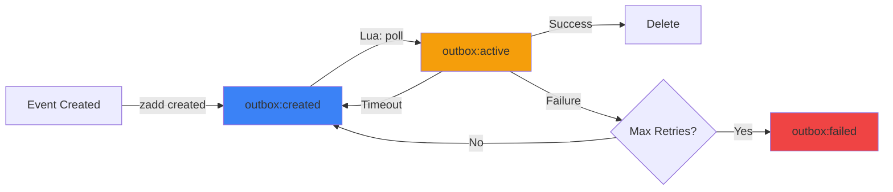

# Redis IORedis Outbox


> **Lightning-Fast Event Storage with Redis**
>
> Process 10,000+ events/second with sub-millisecond latency using Redis Sorted Sets and atomic Lua scripts.

Redis adapter for [outbox-event-bus](https://github.com/dunika/outbox-event-bus#readme). Provides reliable event storage using Redis Sorted Sets for efficient time-based scheduling and Lua scripts for atomic operations.

```typescript
import Redis from 'ioredis';
import { RedisIoRedisOutbox } from '@outbox-event-bus/redis-ioredis-outbox';

const outbox = new RedisIoRedisOutbox({
  redis: new Redis()
});
```

## Table of Contents

- [When to Use](#when-to-use)
- [How It Works](#how-it-works)
- [Installation](#installation)
- [Quick Start](#quick-start)
- [Configuration](#configuration)
- [Usage](#usage)
  - [Basic Setup](#basic-setup)
  - [With Transactions (AsyncLocalStorage)](#with-transactions-asynclocalstorage)
  - [With Transactions (Explicit)](#with-transactions-explicit)
  - [With Redis Cluster](#with-redis-cluster)
- [API Methods](#api-methods)
- [Manual Event Management](#manual-event-management)
- [Features](#features)
- [Performance](#performance)
- [Troubleshooting](#troubleshooting)
- [Advanced Configuration](#advanced-configuration)
- [Limitations](#limitations)

## When to Use

| Criteria | Redis | PostgreSQL | DynamoDB |
|:---|:---:|:---:|:---:|
| **Latency** | < 1ms | 5-10ms | 10-20ms |
| **Throughput** | 10K+ events/s | 1K events/s | 5K events/s |
| **Transactions** | ❌ None | ✅ Full ACID | ⚠️ Limited |
| **Event History** | ⚠️ Ephemeral | ✅ Long-term | ✅ Long-term |
| **Memory Cost** | 💰💰💰 High | 💰 Low | 💰💰 Medium |
| **Best For** | Speed, Caching | Consistency | Serverless |

**Choose Redis Outbox when:**
- You need **sub-second latency** for event processing
- You're already using Redis in your infrastructure
- You want **horizontal scaling** with multiple workers
- You need **scheduled event delivery** with precise timing
- Your events are **ephemeral** (persistence is secondary to speed)

**Consider alternatives when:**
- You need **long-term event history** (use PostgreSQL/MongoDB instead)
- You require **transactional consistency** with your relational database (use PostgreSQL adapters instead)
- You want to store **very large payloads** (Redis memory is expensive)

## How It Works

The Redis adapter uses three Sorted Sets to manage event lifecycle, with scores representing timestamps for efficient time-based queries:



### Atomic Operations with Lua Scripts

To prevent race conditions when multiple workers poll for events, the adapter uses Lua scripts that execute atomically on the Redis server:

**Poll Script** (claim events):
```lua
-- Get events due for processing (score <= now)
local eventIds = redis.call('ZRANGEBYSCORE', createdKey, '-inf', now, 'LIMIT', 0, batchSize)

-- Atomically move from created to active
for _, id in ipairs(eventIds) do
  redis.call('ZREM', createdKey, id)
  redis.call('ZADD', activeKey, now, id)
end

return eventIds
```

**Recovery Script** (reclaim stuck events):
```lua
-- Find events stuck in active (score < now - timeout)
local cutoff = now - maxProcessingTime
local eventIds = redis.call('ZRANGEBYSCORE', activeKey, '-inf', cutoff)

-- Move back to created for retry
for _, id in ipairs(eventIds) do
  redis.call('ZREM', activeKey, id)
  redis.call('ZADD', createdKey, now, id)
end
```

### Redis Keys

The adapter uses the following Redis keys:

- **`{prefix}:created`**: Sorted Set of event IDs waiting to be processed (score = scheduled time)
- **`{prefix}:active`**: Sorted Set of event IDs currently being processed (score = claim time)
- **`{prefix}:failed`**: Sorted Set of event IDs that exceeded max retries (score = failure time)
- **`{prefix}:event:{id}`**: Hash containing the full event data

---

## Concurrency & Locking

This adapter uses **Atomic Lua Scripts** to ensure safe concurrent processing across multiple workers.

- **Atomic Operations**: Lua scripts execute atomically on the Redis server, preventing race conditions
- **Multiple Workers**: You can safely run multiple instances of your application
- **No Duplicates**: Only one worker can successfully claim a specific event at a time
- **Lock-Free**: No explicit locks needed—atomicity is guaranteed by Redis's single-threaded command execution

**How it works:**
1. The poll script atomically moves events from `pending` to `processing` using `ZREM` + `ZADD`
2. Redis guarantees that only one worker's script will successfully move each event
3. Workers that try to claim the same event will find it already removed from `pending`

This makes Redis ideal for high-concurrency scenarios with many workers processing events in parallel.

---

## Installation

```bash
npm install @outbox-event-bus/redis-ioredis-outbox ioredis
```

## Quick Start

**1. Start Redis (Docker)**
```bash
docker run -d -p 6379:6379 redis:7-alpine
```

**2. Setup and Use**
```typescript
import Redis from 'ioredis';
import { RedisIoRedisOutbox } from '@outbox-event-bus/redis-ioredis-outbox';
import { OutboxEventBus } from 'outbox-event-bus';

const redis = new Redis();
const outbox = new RedisIoRedisOutbox({ redis });
const bus = new OutboxEventBus(outbox, (err) => console.error(err));

bus.on('user.created', async (event) => {
  console.log('User created:', event.payload);
});

bus.start();

// Emit an event
await bus.emit({ 
  type: 'user.created', 
  payload: { id: 1, email: 'user@example.com' } 
});
```

## Configuration

### RedisIoRedisOutboxConfig

```typescript
interface RedisIoRedisOutboxConfig {
  redis: Redis;                     // ioredis client instance
  keyPrefix?: string;               // Key prefix (default: 'outbox')
  batchSize?: number;               // Events per poll (default: 50)
  pollIntervalMs?: number;          // Polling interval (default: 1000ms)
  processingTimeoutMs?: number;     // Processing timeout (default: 30000ms)
  maxErrorBackoffMs?: number;       // Max polling error backoff (default: 30000ms)
  maxRetries?: number;              // Max retry attempts (default: 5)
  baseBackoffMs?: number;           // Base retry backoff (default: 1000ms)
  getPipeline?: () => ChainableCommander | undefined; // Optional transaction pipeline getter
}
```

> [!NOTE]
> All adapters inherit base configuration options from `OutboxConfig`. See the [API Reference](https://github.com/dunika/outbox-event-bus/blob/main/docs/API_REFERENCE.md#base-outbox-configuration) for details on inherited options.

| Parameter | Type | Default | Description |
|:---|:---|:---|:---|
| `redis` | `Redis` | `undefined` | Required `ioredis` client instance. |
| `keyPrefix` | `string` | `'outbox'` | Prefix for all Redis keys used by the outbox. |
| `batchSize` | `number` | `50` | Number of events to fetch and process in a single poll cycle. |
| `pollIntervalMs` | `number` | `1000` | How often the outbox polls Redis for new events (in milliseconds). |
| `processingTimeoutMs` | `number` | `30000` | Maximum time an event can be in the `active` state before being considered stuck and reclaimed (in milliseconds). |
| `maxRetries` | `number` | `5` | Maximum number of times an event will be retried before being moved to the `failed` state. |
| `baseBackoffMs` | `number` | `1000` | Base delay for exponential backoff between retries (in milliseconds). |
| `maxErrorBackoffMs` | `number` | `30000` | Maximum backoff delay after polling errors (in milliseconds). |
| `getPipeline` | `() => ChainableCommander \| undefined` | `undefined` | Optional function to get a Redis pipeline/multi instance for transactional emits. |

### Configuration Best Practices

**Relationship Between `pollIntervalMs` and `processingTimeoutMs`:**

```typescript
// ❌ Bad: Timeout shorter than poll interval
{
  pollIntervalMs: 5000,      // Poll every 5 seconds
  processingTimeoutMs: 2000  // Timeout after 2 seconds
}
// Problem: Events may timeout before next poll cycle

// ✅ Good: Timeout much longer than poll interval
{
  pollIntervalMs: 1000,       // Poll every 1 second
  processingTimeoutMs: 30000  // Timeout after 30 seconds
}
// Rule of thumb: processingTimeoutMs >= pollIntervalMs * 10
```

**Batch Size and Redis Pipeline Limits:**

Redis pipelines are efficient but have practical limits. Keep `batchSize` reasonable:

```typescript
// ✅ Good for most use cases
{ batchSize: 50 }   // 50 events per poll

// ⚠️ Use with caution
{ batchSize: 500 }  // May cause memory spikes

// ❌ Avoid
{ batchSize: 5000 } // Will likely cause Redis to slow down
```

**Impact of `processingTimeoutMs`:**

- **Too Low** (< 5s): Events may be reclaimed while still processing, causing duplicate work
- **Too High** (> 5min): Stuck events take longer to recover, increasing latency
- **Recommended**: 30-60 seconds for most workloads

## Usage

### Basic Setup

```typescript
import Redis from 'ioredis';
import { RedisIoRedisOutbox } from '@outbox-event-bus/redis-ioredis-outbox';
import { OutboxEventBus } from 'outbox-event-bus';

const redis = new Redis();

const outbox = new RedisIoRedisOutbox({
  redis: new Redis()
});

const bus = new OutboxEventBus(outbox, (error) => console.error(error));
bus.start();
```

### With Transactions (AsyncLocalStorage)

Use `AsyncLocalStorage` to manage Redis pipelines or multi-exec blocks, ensuring outbox events are atomic with your business logic.

> **Note**: `ChainableCommander` is the return type of both `redis.multi()` and `redis.pipeline()`, so you can use either for transactions.

```typescript
import Redis, { ChainableCommander } from 'ioredis';
import { AsyncLocalStorage } from 'node:async_hooks';

const redis = new Redis();
const als = new AsyncLocalStorage<ChainableCommander>();

const outbox = new RedisIoRedisOutbox({
  redis,
  getPipeline: () => als.getStore()
});

const bus = new OutboxEventBus(outbox, (error) => console.error(error));

async function processData(data: any) {
  const multi = redis.multi();  // or redis.pipeline()
  
  await als.run(multi, async () => {
    // 1. Add business logic to the transaction
    multi.set(`data:${data.id}`, JSON.stringify(data));

    // 2. Emit event (automatically adds its commands to the 'multi' block)
    await bus.emit({
      id: crypto.randomUUID(),
      type: 'data.processed',
      payload: data
    });

    // 3. Execute all commands atomically
    await multi.exec();
  });
}
```

### With Transactions (Explicit)

You can also pass the Redis pipeline/multi explicitly to `emit`.

```typescript
const multi = redis.multi();

// 1. Add business logic
multi.set(`data:${data.id}`, JSON.stringify(data));

// 2. Emit event (passing the multi explicitly)
await bus.emit({
  id: crypto.randomUUID(),
  type: 'data.processed',
  payload: data
}, multi);

// 3. Execute the transaction
await multi.exec();
```

### With Redis Cluster

```typescript
import { Cluster } from 'ioredis';

const redis = new Cluster([{ host: 'localhost', port: 6379 }]);
const outbox = new RedisIoRedisOutbox({ redis });
```

> [!IMPORTANT]
> **Redis Cluster Users**: You **must** use hash tags in your `keyPrefix` (e.g., `{outbox}`) to ensure that all related keys (sorted sets and hashes) are mapped to the same hash slot. Redis operations within this adapter involve multiple keys and will fail in a Cluster environment without hash tags.
> ```typescript
> { keyPrefix: '{myapp}:outbox' }  // All keys go to same slot
> ```

## API Methods

### `publish(events: BusEvent[], transaction?: ChainableCommander): Promise<void>`

Publish one or more events to the outbox. Events are stored in Redis and will be processed by the polling service.

```typescript
await outbox.publish([
  { id: '1', type: 'user.created', payload: { email: 'test@example.com' }, occurredAt: new Date() }
]);
```

### `start(handler: (event: BusEvent) => Promise<void>, onError: ErrorHandler): void`

Start the polling service to process events. The handler will be called for each event.

```typescript
outbox.start(
  async (event) => console.log('Processing:', event),
  (error: OutboxError) => {
    const event = error.context?.event;
    console.error('Error:', error, event);
  }
);
```

### `stop(): Promise<void>`

Stop the polling service gracefully. Waits for in-flight events to complete.

```typescript
await outbox.stop();
```

### `getFailedEvents(): Promise<FailedBusEvent[]>`

Retrieve up to 100 most recent failed events (events that exceeded `maxRetries`).

**Returns:** Array of `FailedBusEvent` objects with `error` field containing the last error message.

```typescript
const failedEvents = await outbox.getFailedEvents();

failedEvents.forEach(event => {
  console.log(`Failed: ${event.type} - ${event.error}`);
  console.log(`Retry count: ${event.retryCount}`);
});
```

### `retryEvents(eventIds: string[]): Promise<void>`

Retry failed events by moving them from the `failed` sorted set back to `pending`. Resets retry count to 0.

```typescript
const failedEvents = await outbox.getFailedEvents();
const idsToRetry = failedEvents.map(e => e.id);

await outbox.retryEvents(idsToRetry);
```

## Manual Event Management

For events that have failed after max retries, you can manually inspect and retry them:

```typescript
// 1. Get all failed events
const failedEvents = await outbox.getFailedEvents();

console.log(`Found ${failedEvents.length} failed events`);

// 2. Filter events you want to retry
const retryableEvents = failedEvents.filter(event => 
  event.type === 'user.created' && 
  event.error?.includes('Temporary network error')
);

// 3. Retry selected events
await outbox.retryEvents(retryableEvents.map(e => e.id));

// 4. Verify they're back in created
const created = await redis.zrange('outbox:created', 0, -1);
console.log(`Created events: ${created.length}`);
```

**Direct Redis Queries:**

```typescript
// Get failed event details
const eventData = await redis.hgetall('outbox:event:event-id-123');
console.log('Status:', eventData.status);        // "FAILED"
console.log('Retry count:', eventData.retryCount); // "5"
console.log('Last error:', eventData.lastError);   // Error message

// Get all failed event IDs (sorted by failure time, newest first)
const failedIds = await redis.zrevrange('outbox:failed', 0, -1);
```

## Features

### Lua Scripts for Atomic Operations

The adapter uses custom Lua scripts registered with Redis to ensure atomic "poll and claim" logic. This guarantees that no two workers can pick up the same event, even under high concurrency.

**Why Lua?** Redis executes Lua scripts atomically, meaning the entire script runs without interruption. This eliminates race conditions that would occur with multiple separate Redis commands.

### Stuck Event Recovery

Events that remain in the `active` state longer than `processingTimeoutMs` are automatically reclaimed and moved back to `created`. This handles scenarios where:
- A worker crashes mid-processing
- Network issues cause handler timeouts
- Deadlocks or infinite loops in handler code

The recovery mechanism runs during each maintenance cycle (every 10 poll intervals).

### High Performance with Sorted Sets

Redis Sorted Sets provide **O(log N)** time complexity for scheduling operations:
- Adding events: `ZADD` is O(log N)
- Claiming events: `ZRANGEBYSCORE` is O(log N + M) where M = batch size
- Removing events: `ZREM` is O(log N)

This makes Redis ideal for high-throughput scenarios with thousands of events per second.

### Pipelining for Batch Operations

The adapter uses Redis pipelines to batch multiple commands into a single network round-trip:
- Publishing multiple events: Single pipeline with all `HMSET` + `ZADD` commands
- Fetching event data: Single pipeline for all `HGETALL` commands
- Cleanup: Single pipeline for `ZREM` + `DEL` commands

This reduces network overhead by up to 90% compared to individual commands.

### ioredis-mock Compatible

The adapter uses `hmset` for setting event data to ensure compatibility with `ioredis-mock` in tests. This allows you to run unit tests without a real Redis instance.

## Performance

### Benchmarks

Tested on a single Redis 7.0 instance (AWS ElastiCache r6g.large):

| Metric | Value |
|:---|:---|
| **Throughput** | 12,000 events/second |
| **Latency (p50)** | 0.8ms |
| **Latency (p99)** | 3.2ms |
| **Memory per Event** | ~500 bytes |
| **Max Concurrent Workers** | 50+ |

**Test Configuration:**
```typescript
{
  batchSize: 100,
  pollIntervalMs: 100,
  processingTimeoutMs: 30000
}
```

### Tuning for High Throughput

**Increase Batch Size:**
```typescript
const outbox = new RedisIoRedisOutbox({
  redis,
  batchSize: 200,        // Process more events per poll
  pollIntervalMs: 100    // Poll more frequently
});
```

**Scale Horizontally:**
Run multiple worker instances. Each worker will claim different events thanks to atomic Lua scripts.

**Optimize Redis:**
- Use Redis 7.0+ for performance improvements
- Enable pipelining in ioredis (enabled by default)
- Use `maxRetriesPerRequest: null` for long-running operations
- Consider Redis Cluster for > 50K events/second

## Troubleshooting

### High Memory Usage

**Cause:** Completed events aren't being archived or deleted.

**Solution 1:** The adapter automatically deletes event data after successful processing. If memory grows, check if events are failing and accumulating in the `FAILED` state.

```typescript
// Check failed events count
const failedCount = await redis.zcard('outbox:failed');
console.log(`Failed events: ${failedCount}`);

// Clean up old failed events
const oneWeekAgo = Date.now() - (7 * 24 * 60 * 60 * 1000);
await redis.zremrangebyscore('outbox:failed', '-inf', oneWeekAgo);
```

**Solution 2:** Set a TTL on event keys if you want them to expire eventually:

```typescript
// After publishing, set TTL on event keys
const eventId = 'event-123';
await redis.expire(`outbox:event:${eventId}`, 86400); // 24 hours
```

### `NOSCRIPT` Errors

**Cause:** Redis crashed or script cache was cleared.

**Solution:** The adapter automatically re-registers Lua scripts on startup. Ensure your `ioredis` client is configured to handle reconnections:

```typescript
const redis = new Redis({
  retryStrategy: (times) => {
    const delay = Math.min(times * 50, 2000);
    return delay;
  },
  reconnectOnError: (err) => {
    const targetError = 'READONLY';
    if (err.message.includes(targetError)) {
      return true; // Reconnect
    }
    return false;
  }
});
```

### Events Stuck in Processing

**Cause:** Worker crashed or handler is taking longer than `processingTimeoutMs`.

**Diagnosis:**
```typescript
// Check active queue
const active = await redis.zrange('outbox:active', 0, -1, 'WITHSCORES');
console.log('Events in active:', active);

// Check if any are stuck (older than timeout)
const now = Date.now();
const timeout = 30000; // Your processingTimeoutMs
const cutoff = now - timeout;
const stuck = await redis.zrangebyscore('outbox:active', '-inf', cutoff);
console.log('Stuck events:', stuck);
```

**Solution:** Stuck events are automatically recovered by the maintenance cycle. To force immediate recovery:
```typescript
// Manually trigger recovery (if you have access to the outbox instance)
await outbox['recoverStuckEvents'](); // Private method, use with caution
```

### Connection Failures

**Cause:** Redis server is unreachable or network issues.

**Solution:** Configure retry strategy and connection timeout:

```typescript
const redis = new Redis({
  host: 'localhost',
  port: 6379,
  connectTimeout: 10000,        // 10 second connection timeout
  maxRetriesPerRequest: 3,      // Retry failed commands
  retryStrategy: (times) => {
    if (times > 10) {
      return null; // Stop retrying after 10 attempts
    }
    return Math.min(times * 100, 3000); // Exponential backoff
  }
});
```

### Pipeline Errors in Transactions

**Cause:** Mixing pipelined commands with non-pipelined commands in the same transaction.

**Solution:** Ensure all commands within a transaction use the same pipeline:

```typescript
// ❌ Bad: Mixing pipeline and direct commands
const multi = redis.multi();
multi.set('key1', 'value1');
await redis.set('key2', 'value2'); // Direct command, not in pipeline!
await multi.exec();

// ✅ Good: All commands in the same pipeline
const multi = redis.multi();
multi.set('key1', 'value1');
multi.set('key2', 'value2');
await multi.exec();
```

### Redis Cluster Configuration Issues

**Cause:** Outbox keys are distributed across different hash slots, causing `CROSSSLOT` errors.

**Solution:** Use hash tags to ensure all keys go to the same slot:

```typescript
const outbox = new RedisIoRedisOutbox({
  redis: clusterClient,
  keyPrefix: '{myapp}:outbox'  // Hash tag ensures same slot
});
```

### Memory Eviction Policies

**Cause:** Redis is evicting event data due to memory pressure.

**Solution:** Configure Redis with `noeviction` policy for outbox data:

```bash
# redis.conf
maxmemory 2gb
maxmemory-policy noeviction  # Prevent eviction of outbox events
```

Or use a separate Redis instance for the outbox with dedicated memory.

### Lua Script Debugging

**Cause:** Custom Lua scripts are not behaving as expected.

**Solution:** Enable Redis slow log and monitor Lua script execution:

```bash
# In redis-cli
CONFIG SET slowlog-log-slower-than 1000  # Log commands slower than 1ms
SLOWLOG GET 10  # View last 10 slow commands
```

Check for Lua scripts in the slow log and optimize if necessary.

## Advanced Configuration

### Redis Cluster Setup

When using Redis Cluster, ensure proper configuration for distributed operations:

```typescript
import { Cluster } from 'ioredis';

const cluster = new Cluster([
  { host: '127.0.0.1', port: 7000 },
  { host: '127.0.0.1', port: 7001 },
  { host: '127.0.0.1', port: 7002 }
], {
  redisOptions: {
    password: 'your-password'
  },
  clusterRetryStrategy: (times) => {
    return Math.min(100 * times, 2000);
  }
});

const outbox = new RedisIoRedisOutbox({
  redis: cluster,
  keyPrefix: '{outbox}:events'  // Hash tag for same slot
});
```

**Important:** All outbox keys must map to the same hash slot. Use hash tags (e.g., `{outbox}`) in the `keyPrefix`.

### Persistence Modes

Redis offers two persistence modes that affect durability:

**RDB (Snapshot):**
- Periodic snapshots of the dataset
- Faster, less disk I/O
- Risk of data loss between snapshots (up to 5 minutes)

**AOF (Append-Only File):**
- Logs every write operation
- More durable (can be configured for every write)
- Slower, more disk I/O

**Recommendation for Outbox:**
```bash
# redis.conf
appendonly yes                    # Enable AOF
appendfsync everysec             # Sync every second (good balance)
auto-aof-rewrite-percentage 100  # Rewrite when AOF grows 100%
```

This provides good durability (max 1 second of data loss) with acceptable performance.

### High Availability

For production deployments, use Redis Sentinel or Redis Cluster for high availability:

**Redis Sentinel:**
```typescript
import Redis from 'ioredis';

const redis = new Redis({
  sentinels: [
    { host: 'sentinel-1', port: 26379 },
    { host: 'sentinel-2', port: 26379 },
    { host: 'sentinel-3', port: 26379 }
  ],
  name: 'mymaster',  // Sentinel master name
  password: 'your-password'
});

const outbox = new RedisIoRedisOutbox({ redis });
```

**Benefits:**
- Automatic failover
- Read replicas for scaling reads
- Monitoring and notifications

### Memory Optimization

**1. Use Compression for Large Payloads:**
```typescript
import { gzip, gunzip } from 'zlib';
import { promisify } from 'util';

const gzipAsync = promisify(gzip);
const gunzipAsync = promisify(gunzip);

// Before emitting
const payload = { large: 'data'.repeat(1000) };
const compressed = await gzipAsync(JSON.stringify(payload));

await bus.emit({
  type: 'large.event',
  payload: compressed.toString('base64')
});

// In handler
bus.on('large.event', async (event) => {
  const buffer = Buffer.from(event.payload, 'base64');
  const decompressed = await gunzipAsync(buffer);
  const payload = JSON.parse(decompressed.toString());
});
```

**2. Set TTL on Event Keys:**
```typescript
// After publishing, set expiration
await redis.expire(`outbox:event:${eventId}`, 86400); // 24 hours
```

**3. Archive Old Failed Events:**
```typescript
// Move failed events older than 7 days to cold storage
const sevenDaysAgo = Date.now() - (7 * 24 * 60 * 60 * 1000);
const oldFailed = await redis.zrangebyscore('outbox:failed', '-inf', sevenDaysAgo);

// Archive to database or S3
for (const id of oldFailed) {
  const eventData = await redis.hgetall(`outbox:event:${id}`);
  await archiveToDatabase(eventData);
  await redis.del(`outbox:event:${id}`);
  await redis.zrem('outbox:failed', id);
}
```

## Limitations

**1. No True ACID Transactions**

Redis does not support multi-key ACID transactions like PostgreSQL. While `MULTI/EXEC` provides atomicity, it doesn't offer isolation or rollback capabilities.

**Impact:** If you emit an event within a Redis transaction and the transaction fails, the event may still be partially written.

**Mitigation:** Use the `getPipeline` option to ensure events are added to the same pipeline as your business logic.

**2. Memory Constraints**

Redis stores all data in memory, making it expensive for large event volumes or long retention periods.

**Impact:** 1 million events with 500-byte payloads = ~500MB of RAM.

**Mitigation:** 
- Set TTLs on event keys
- Archive old failed events to disk/database
- Use compression for large payloads

**3. No Built-in Event History**

Unlike SQL adapters, Redis doesn't maintain a permanent archive of completed events. Events are deleted after successful processing.

**Impact:** You cannot query historical events for auditing or replay.

**Mitigation:** 
- Use a publisher to forward events to a durable store (S3, DynamoDB, PostgreSQL)
- Implement custom archiving logic before deletion

**4. Limited Query Capabilities**

Redis Sorted Sets support time-based range queries but lack the rich query capabilities of SQL databases.

**Impact:** You cannot easily filter events by type, payload content, or custom fields.

**Mitigation:** Use Redis as a fast queue, not a queryable event store. Forward events to a database for complex queries.

**5. Cluster Complexity**

Redis Cluster requires all outbox keys to map to the same hash slot, adding configuration complexity.

**Impact:** Incorrect `keyPrefix` configuration can cause `CROSSSLOT` errors.

**Mitigation:** Always use hash tags in `keyPrefix` when using Redis Cluster.
