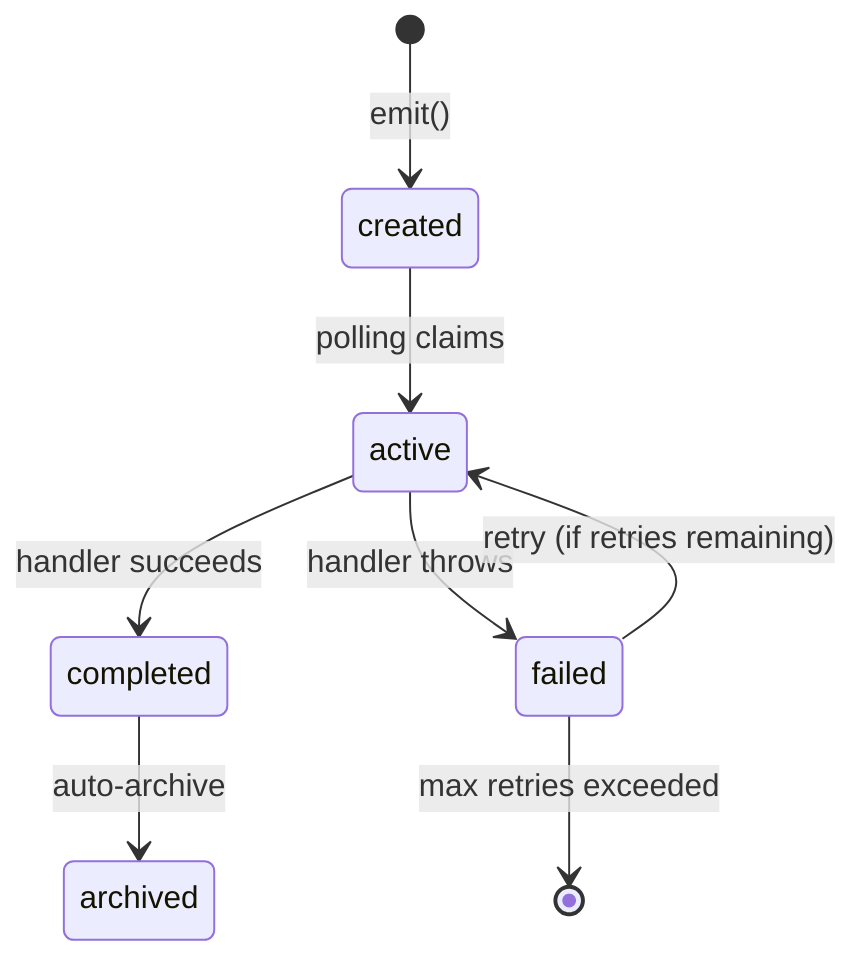

# SQLite Better-SQLite3 Outbox


> **Reliable event storage for single-instance applications—zero external dependencies.**

A SQLite adapter for the [Outbox Pattern](../../README.md), providing transactional event storage with automatic retry, archiving, and WAL-mode concurrency. Perfect for local development, testing, desktop applications, and single-instance deployments.

**Perfect for:**
- 🧪 Local development & testing
- 🖥️ Desktop applications & CLI tools
- 📦 Single-instance deployments
- ⚡ Zero-config event storage

**Quick Links:** [Installation](#installation) · [Getting Started](#getting-started) · [Configuration](#configuration) · [Transactions](#transactions) · [API Reference](#api-reference) · [Troubleshooting](#troubleshooting)

---

## When to Use

| Feature | SQLite | Redis | PostgreSQL | DynamoDB |
|---------|--------|-------|------------|----------|
| **Setup Complexity** | ⭐ Zero config | ⭐⭐ Docker/Cloud | ⭐⭐⭐ Server required | ⭐⭐⭐ AWS setup |
| **Horizontal Scaling** | ❌ Single instance | ✅ Yes | ✅ Yes | ✅ Yes |
| **Write Throughput** | ~1K events/sec | ~10K events/sec | ~5K events/sec | ~10K events/sec |
| **Best For** | Dev, CLI, Desktop | High throughput | ACID guarantees | Cloud-native |

**Choose SQLite when:**
- ✅ You're in **local development** or testing
- ✅ You have a **single-instance deployment** (no horizontal scaling)
- ✅ You want **zero external dependencies**
- ✅ You're building a **desktop application** or CLI tool

**Consider alternatives when:**
- ❌ You need **horizontal scaling** across multiple servers → use [Redis](../redis-ioredis) or [DynamoDB](../dynamodb-aws-sdk)
- ❌ You require **high write throughput** (>1K events/sec) → SQLite serializes writes
- ❌ You want **cloud-native deployment** → use managed database services

---

## Installation

```bash
npm install @outbox-event-bus/sqlite-better-sqlite3-outbox outbox-event-bus
```

---

## Getting Started

### 1. Create Your First Event Bus

```typescript
import { SqliteBetterSqlite3Outbox } from '@outbox-event-bus/sqlite-better-sqlite3-outbox';
import { OutboxEventBus } from 'outbox-event-bus';

// 1. Create the outbox
const outbox = new SqliteBetterSqlite3Outbox({
  dbPath: './events.db'
});

// 2. Create the bus
const bus = new OutboxEventBus(outbox, console.error);

// 3. Listen for events
bus.on('user.created', async (event) => {
  console.log('New user:', event.payload);
});

// 4. Start processing
bus.start();

// 5. Emit an event
await bus.emit({
  id: crypto.randomUUID(),
  type: 'user.created',
  payload: { name: 'Alice' }
});
```

### 2. Verify It Works

Check your database to see the archived event:

```bash
sqlite3 events.db "SELECT * FROM outbox_events_archive;"
```

> [!TIP]
> Use `:memory:` for blazing-fast in-memory testing without disk I/O:
> ```typescript
> const outbox = new SqliteBetterSqlite3Outbox({ dbPath: ':memory:' });
> ```

---

## Features

### 🔄 Automatic Retry with Exponential Backoff

Failed events are automatically retried up to 5 times (configurable) with exponentially increasing delays between attempts.

```typescript
const outbox = new SqliteBetterSqlite3Outbox({
  maxRetries: 3,
  baseBackoffMs: 1000  // Delays: 1s, 2s, 4s
});
```

### 🔒 ACID Transactions

Events are committed atomically with your business data—no partial writes, guaranteed consistency.

```typescript
db.transaction(() => {
  db.prepare('INSERT INTO users (name) VALUES (?)').run('Alice');
  bus.emit({ type: 'user.created', payload: { name: 'Alice' } });
})();  // Both committed together or both rolled back
```

### 📦 Auto-Archiving

Completed events are automatically moved to `outbox_events_archive` for audit trails without bloating the active table.

### 🛡️ Stuck Event Recovery

Events that timeout during processing are automatically reclaimed and retried, preventing lost events.

### 🔍 Failed Event Inspection

Query and manually retry failed events:

```typescript
const failed = await outbox.getFailedEvents();
console.log(failed[0].error);  // Last error message
await outbox.retryEvents(failed.map(e => e.id));
```

---

## Concurrency & Locking

SQLite is designed for **single-instance deployments** and uses **file-level locking** for concurrency control.

- **Single Writer**: Only one write transaction can execute at a time (serialized writes)
- **WAL Mode**: Enables concurrent reads during writes (readers don't block writers)
- **No Distributed Locking**: Not suitable for horizontal scaling across multiple servers
- **Thread-Safe**: Safe for multi-threaded applications within a single process

> [!WARNING]
> Do not run multiple instances of your application with the same SQLite database file. This can lead to database corruption. For multi-instance deployments, use [PostgreSQL](../postgres-prisma), [Redis](../redis-ioredis), or [DynamoDB](../dynamodb-aws-sdk) adapters instead.

### ⚡ WAL Mode for Concurrency

Write-Ahead Logging (WAL) enables concurrent reads during writes, improving throughput and reducing lock contention.

**Why WAL matters:**
- ✅ Readers don't block writers
- ✅ Writers don't block readers
- ✅ Better performance for write-heavy workloads
- ✅ Crash recovery without data loss

Without WAL, SQLite uses rollback journaling, which blocks all reads during writes.

### 🎨 Custom Table Names

Integrate with existing schemas by customizing table names:

```typescript
const outbox = new SqliteBetterSqlite3Outbox({
  dbPath: './app.db',
  tableName: 'my_events',
  archiveTableName: 'my_events_history'
});
```

### 📘 Full TypeScript Support

Complete type definitions for all APIs and configurations with full IntelliSense support.

---

## Transactions

### With AsyncLocalStorage (Recommended)

Use `AsyncLocalStorage` to manage SQLite transactions, ensuring outbox events are committed along with your business data.

> [!NOTE]
> better-sqlite3 transactions are synchronous, but `bus.emit()` is async. The recommended pattern is to call `emit()` synchronously within the transaction (it queues the write) and the actual I/O happens immediately since better-sqlite3 is synchronous.

```typescript
import Database from 'better-sqlite3';
import { AsyncLocalStorage } from 'node:async_hooks';

const als = new AsyncLocalStorage<Database.Database>();

const outbox = new SqliteBetterSqlite3Outbox({
  dbPath: './data/events.db',
  getTransaction: () => als.getStore()
});

const bus = new OutboxEventBus(outbox, (error) => console.error(error));

async function createUser(user: any) {
  const db = new Database('./data/events.db');
  
  // Run the transaction synchronously
  const transaction = db.transaction(() => {
    // Set ALS context for the transaction
    return als.run(db, () => {
      // 1. Save business data
      db.prepare('INSERT INTO users (name) VALUES (?)').run(user.name);

      // 2. Emit event (synchronously writes to outbox table via ALS)
      void bus.emit({
        id: crypto.randomUUID(),
        type: 'user.created',
        payload: user
      });
    });
  });

  // Execute the transaction
  transaction();
}
```

### With AsyncLocalStorage Helper

Use the provided `withBetterSqlite3Transaction` helper for cleaner async transaction management:

```typescript
import { 
  SqliteBetterSqlite3Outbox, 
  withBetterSqlite3Transaction,
  getBetterSqlite3Transaction 
} from '@outbox-event-bus/sqlite-better-sqlite3-outbox';
import Database from 'better-sqlite3';

const db = new Database('./events.db');

const outbox = new SqliteBetterSqlite3Outbox({
  db,
  getTransaction: getBetterSqlite3Transaction()
});

const bus = new OutboxEventBus(outbox, console.error);

async function createUser(user: any) {
  await withBetterSqlite3Transaction(db, async (tx) => {
    // 1. Save business data
    tx.prepare('INSERT INTO users (name) VALUES (?)').run(user.name);

    // 2. Emit event (uses transaction from AsyncLocalStorage)
    await bus.emit({
      id: crypto.randomUUID(),
      type: 'user.created',
      payload: user
    });
  });
}
```

### With Explicit Transaction

You can also pass the SQLite database instance explicitly to `emit`:

```typescript
const db = new Database('./data/events.db');

const transaction = db.transaction(() => {
  // 1. Save business data
  db.prepare('INSERT INTO users (name) VALUES (?)').run(user.name);

  // 2. Emit event (passing the db explicitly)
  void bus.emit({
    id: crypto.randomUUID(),
    type: 'user.created',
    payload: user
  }, db);
});

transaction();
```

---

## How-to Guides

### Retry Failed Events

```typescript
// 1. Get all failed events
const failed = await outbox.getFailedEvents();

// 2. Inspect errors
for (const event of failed) {
  console.log(`Event ${event.id} failed ${event.retryCount} times`);
  console.log(`Last error: ${event.error}`);
}

// 3. Retry specific events
const retryable = failed.filter(e => e.retryCount < 3);
await outbox.retryEvents(retryable.map(e => e.id));
```

### Debug Stuck Events

Find events stuck in `active` state:

```sql
SELECT * FROM outbox_events 
WHERE status = 'active' 
  AND datetime(keep_alive, '+' || expire_in_seconds || ' seconds') < datetime('now');
```

These events will be automatically reclaimed on the next polling cycle.

### Use an Existing Database Instance

```typescript
import Database from 'better-sqlite3';

const db = new Database('./app.db');
db.pragma('journal_mode = WAL');

const outbox = new SqliteBetterSqlite3Outbox({ db });
```

### Graceful Shutdown

```typescript
process.on('SIGTERM', async () => {
  console.log('Shutting down...');
  await bus.stop();  // Wait for in-flight events to complete
  process.exit(0);
});
```

### Query the Archive Table

```typescript
import Database from 'better-sqlite3';

const db = new Database('./events.db');

const archived = db.prepare(`
  SELECT * FROM outbox_events_archive
  WHERE type = ?
  ORDER BY completed_on DESC
  LIMIT 100
`).all('user.created');

console.log(archived);
```

---

## Configuration

### SqliteBetterSqlite3OutboxConfig

```typescript
interface SqliteBetterSqlite3OutboxConfig {
  dbPath?: string;
  db?: Database.Database;
  getTransaction?: () => Database.Database | undefined;
  tableName?: string;
  archiveTableName?: string;
  maxRetries?: number;
  baseBackoffMs?: number;
  maxErrorBackoffMs?: number;
  processingTimeoutMs?: number;
  pollIntervalMs?: number;
  batchSize?: number;
}
```

| Option | Type | Default | Description |
|--------|------|---------|-------------|
| `dbPath` | `string` | - | Path to SQLite file. **Required if `db` not provided.** Use `:memory:` for in-memory. |
| `db` | `Database` | - | Existing better-sqlite3 instance. If provided, `dbPath` is ignored. WAL mode must be enabled manually. |
| `getTransaction` | `() => Database \| undefined` | - | Function to retrieve current transaction from AsyncLocalStorage. Use `getBetterSqlite3Transaction()` helper. |
| `tableName` | `string` | `"outbox_events"` | Name of the outbox table. |
| `archiveTableName` | `string` | `"outbox_events_archive"` | Name of the archive table. |
| `maxRetries` | `number` | `5` | Maximum retry attempts before marking event as permanently failed. |
| `baseBackoffMs` | `number` | `1000` | Base delay for exponential backoff (ms). Retry delays: 1s, 2s, 4s, 8s, 16s. |
| `processingTimeoutMs` | `number` | `30000` | Timeout for event handler execution (ms). Events exceeding this are marked as stuck. |
| `pollIntervalMs` | `number` | `1000` | Interval between polling cycles (ms). |
| `batchSize` | `number` | `50` | Maximum events to process per batch. |
| `maxErrorBackoffMs` | `number` | `30000` | Maximum backoff delay after polling errors (ms). |

> [!WARNING]
> You must provide either `dbPath` or `db`. If neither is provided, the constructor will throw an error.

---

## API Reference

### `SqliteBetterSqlite3Outbox`

#### Constructor

```typescript
new SqliteBetterSqlite3Outbox(config: SqliteBetterSqlite3OutboxConfig)
```

Creates a new SQLite outbox adapter. Automatically creates tables and indexes on initialization.

**Throws:**
- `Error` if neither `dbPath` nor `db` is provided

**Example:**
```typescript
const outbox = new SqliteBetterSqlite3Outbox({
  dbPath: './events.db',
  maxRetries: 3,
  batchSize: 100
});
```

---

#### Methods

##### `publish(events: BusEvent[], transaction?: Database): Promise<void>`

Inserts events into the outbox table. Events are inserted with `status = 'created'` and will be picked up by the next polling cycle.

**Parameters:**
- `events` - Array of events to publish
- `transaction` - Optional better-sqlite3 database instance for transactional writes

**Example:**
```typescript
await outbox.publish([
  { 
    id: crypto.randomUUID(), 
    type: 'user.created', 
    payload: { name: 'Alice' }, 
    occurredAt: new Date() 
  }
]);
```

---

##### `getFailedEvents(): Promise<FailedBusEvent[]>`

Retrieves up to 100 failed events, ordered by occurrence time (newest first).

**Returns:** Array of `FailedBusEvent` objects with error details and retry count.

**Example:**
```typescript
const failed = await outbox.getFailedEvents();
for (const event of failed) {
  console.log(`Event ${event.id}:`);
  console.log(`  Type: ${event.type}`);
  console.log(`  Retry Count: ${event.retryCount}`);
  console.log(`  Error: ${event.error}`);
  console.log(`  Last Attempt: ${event.lastAttemptAt}`);
}
```

---

##### `retryEvents(eventIds: string[]): Promise<void>`

Resets failed events to `created` status for retry. Clears retry count, error message, and next retry timestamp.

**Parameters:**
- `eventIds` - Array of event IDs to retry

**Example:**
```typescript
await outbox.retryEvents(['event-id-1', 'event-id-2']);
```

---

##### `start(handler: (event: BusEvent) => Promise<void>, onError: ErrorHandler): void`

Starts polling for events. The handler is called for each event in the batch.

**Parameters:**
- `handler` - Async function to process each event
- `onError` - Error handler called when event processing fails

**Example:**
```typescript
outbox.start(
  async (event) => {
    console.log('Processing:', event);
    // Your event handling logic
  },
  (error, event) => {
    console.error('Failed to process event:', error, event);
  }
);
```

---

##### `stop(): Promise<void>`

Stops polling and waits for in-flight events to complete.

**Example:**
```typescript
await outbox.stop();
```

---

### Helper Functions

#### `withBetterSqlite3Transaction<T>(db: Database, fn: (tx: Database) => Promise<T>): Promise<T>`

Executes an async function within a SQLite transaction using AsyncLocalStorage. Supports nested transactions via savepoints.

**Parameters:**
- `db` - better-sqlite3 database instance
- `fn` - Async function to execute within the transaction

**Returns:** Result of the function

**Example:**
```typescript
import { withBetterSqlite3Transaction } from '@outbox-event-bus/sqlite-better-sqlite3-outbox';

const result = await withBetterSqlite3Transaction(db, async (tx) => {
  tx.prepare('INSERT INTO users (name) VALUES (?)').run('Alice');
  await bus.emit({ type: 'user.created', payload: { name: 'Alice' } });
  return { success: true };
});
```

---

#### `getBetterSqlite3Transaction(): () => Database | undefined`

Returns a function that retrieves the current transaction from AsyncLocalStorage. Use this with the `getTransaction` config option.

**Example:**
```typescript
import { getBetterSqlite3Transaction } from '@outbox-event-bus/sqlite-better-sqlite3-outbox';

const outbox = new SqliteBetterSqlite3Outbox({
  db,
  getTransaction: getBetterSqlite3Transaction()
});
```

---

#### `betterSqlite3TransactionStorage: AsyncLocalStorage<Database>`

The AsyncLocalStorage instance used for transaction management. Exported for advanced use cases.

**Example:**
```typescript
import { betterSqlite3TransactionStorage } from '@outbox-event-bus/sqlite-better-sqlite3-outbox';

const currentTx = betterSqlite3TransactionStorage.getStore();
if (currentTx) {
  console.log('Inside a transaction');
}
```

---

## Database Schema

### `outbox_events` Table

Stores active and pending events.

| Column | Type | Constraints | Description |
|--------|------|-------------|-------------|
| `id` | TEXT | PRIMARY KEY | Unique event identifier |
| `type` | TEXT | NOT NULL | Event type (e.g., `user.created`) |
| `payload` | TEXT | NOT NULL | JSON-serialized event payload |
| `occurred_at` | TEXT | NOT NULL | ISO 8601 timestamp of event occurrence |
| `status` | TEXT | NOT NULL, DEFAULT `'created'` | Event status: `created`, `active`, `failed`, `completed` |
| `retry_count` | INTEGER | NOT NULL, DEFAULT 0 | Number of retry attempts |
| `last_error` | TEXT | - | Last error message (if failed) |
| `next_retry_at` | TEXT | - | ISO 8601 timestamp for next retry attempt |
| `created_on` | TEXT | NOT NULL, DEFAULT CURRENT_TIMESTAMP | Timestamp when event was inserted |
| `started_on` | TEXT | - | Timestamp when processing started |
| `completed_on` | TEXT | - | Timestamp when processing completed |
| `keep_alive` | TEXT | - | Last keep-alive timestamp for stuck event detection |
| `expire_in_seconds` | INTEGER | NOT NULL, DEFAULT 300 | Timeout duration for stuck event detection (5 minutes) |

**Indexes:**
- `idx_outbox_events_status_retry` on `(status, next_retry_at)` - Optimizes polling queries

---

### `outbox_events_archive` Table

Stores successfully processed events for audit purposes.

| Column | Type | Constraints | Description |
|--------|------|-------------|-------------|
| `id` | TEXT | PRIMARY KEY | Unique event identifier |
| `type` | TEXT | NOT NULL | Event type |
| `payload` | TEXT | NOT NULL | JSON-serialized event payload |
| `occurred_at` | TEXT | NOT NULL | ISO 8601 timestamp of event occurrence |
| `status` | TEXT | NOT NULL | Final status (always `completed`) |
| `retry_count` | INTEGER | NOT NULL | Total retry attempts before success |
| `last_error` | TEXT | - | Last error before success (if any) |
| `created_on` | TEXT | NOT NULL | Timestamp when event was inserted |
| `started_on` | TEXT | - | Timestamp when processing started |
| `completed_on` | TEXT | NOT NULL | Timestamp when processing completed |

---

## How It Works

### Event Lifecycle



**State Descriptions:**
- **created**: Event is queued and waiting to be processed
- **active**: Event is currently being processed by a handler
- **failed**: Event processing failed and is waiting for retry
- **completed**: Event processed successfully (moved to archive immediately)
- **archived**: Event is in the archive table for audit purposes

### Polling Mechanism

1. **Claim Events**: Select up to `batchSize` events that are:
   - New events (`status = 'created'`)
   - Failed events ready for retry (`status = 'failed'` AND `retry_count < maxRetries` AND `next_retry_at <= now`)
   - Stuck events (`status = 'active'` AND `keep_alive + expire_in_seconds < now`)

2. **Lock Events**: Update claimed events to `status = 'active'` and set `keep_alive = now`

3. **Process Events**: Call the handler for each event

4. **Handle Results**:
   - **Success**: Archive event and delete from active table
   - **Failure**: Increment `retry_count`, calculate next retry time, update `status = 'failed'`

5. **Repeat**: Wait `pollIntervalMs` and poll again

---

## Troubleshooting

### `SQLITE_BUSY: database is locked`

**Cause:** High write contention or multiple processes accessing the same file.

**Solutions:**
1. Ensure WAL mode is enabled (enabled by default when using `dbPath`)
2. Reduce `pollIntervalMs` or `batchSize` to minimize lock duration
3. Avoid multiple processes accessing the same database file
4. If using an existing `db` instance, enable WAL manually:
   ```typescript
   db.pragma('journal_mode = WAL');
   ```

---

### Data Loss on Crash

**Cause:** SQLite persistence settings or disk cache.

**Solution:** SQLite with WAL mode is highly durable, but ensure:
- Your `dbPath` is on a stable filesystem (not network-mounted)
- For critical data, consider a client-server database (PostgreSQL, etc.)
- Enable synchronous mode for maximum durability (with performance trade-off):
  ```typescript
  db.pragma('synchronous = FULL');
  ```

---

### Events Not Processing

**Checklist:**
1. Did you call `bus.start()`?
2. Is the handler throwing an error? Check `onError` logs
3. Are events stuck in `failed` state? Use `getFailedEvents()` to inspect
4. Check database permissions and file locks

---

### High Memory Usage

**Cause:** Large `batchSize` or large event payloads.

**Solutions:**
1. Reduce `batchSize` (default: 50)
2. Compress large payloads before storing
3. Archive old events regularly:
   ```sql
   DELETE FROM outbox_events_archive WHERE completed_on < datetime('now', '-30 days');
   ```

---

## Performance Tuning

### Optimize Batch Size

```typescript
const outbox = new SqliteBetterSqlite3Outbox({
  dbPath: './events.db',
  batchSize: 100,  // Process more events per cycle
  pollIntervalMs: 500  // Poll more frequently
});
```

**Guidelines:**
- **Low throughput** (<100 events/min): `batchSize: 10-25`
- **Medium throughput** (100-1000 events/min): `batchSize: 50-100`
- **High throughput** (>1000 events/min): Consider Redis or PostgreSQL

---

### Optimize Polling Interval

```typescript
const outbox = new SqliteBetterSqlite3Outbox({
  dbPath: './events.db',
  pollIntervalMs: 100  // Poll every 100ms for low latency
});
```

**Trade-offs:**
- **Lower interval**: Lower latency, higher CPU usage
- **Higher interval**: Lower CPU usage, higher latency

---

## Related Documentation

- [Main README](../../README.md) - Overview of the outbox-event-bus library
- [API Reference](../../docs/API_REFERENCE.md) - Complete API documentation
- [Contributing Guide](../../docs/CONTRIBUTING.md) - How to contribute

---

## License

MIT © [dunika](https://github.com/dunika)
